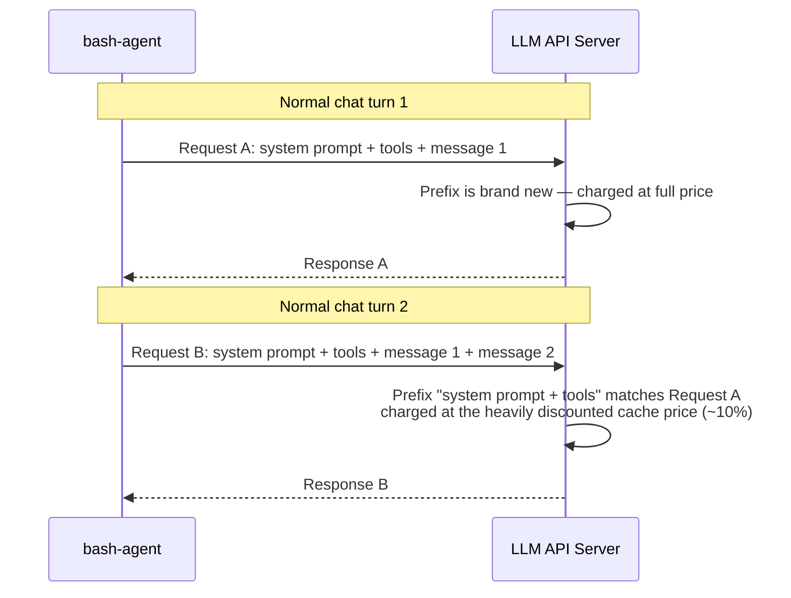
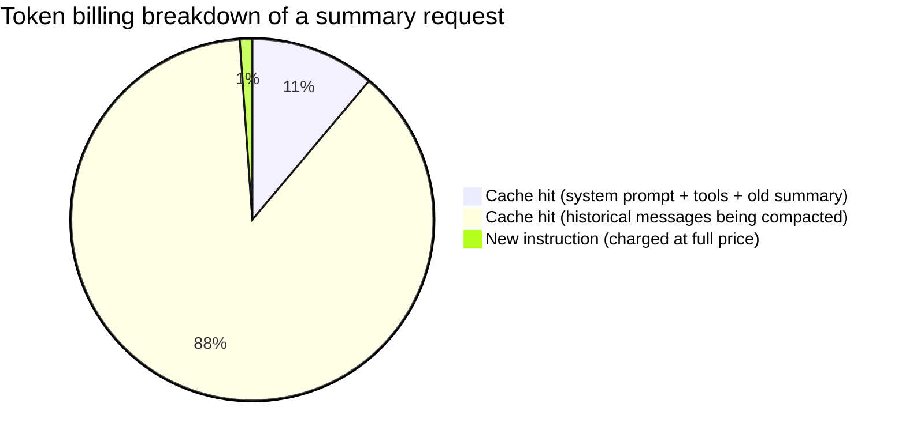
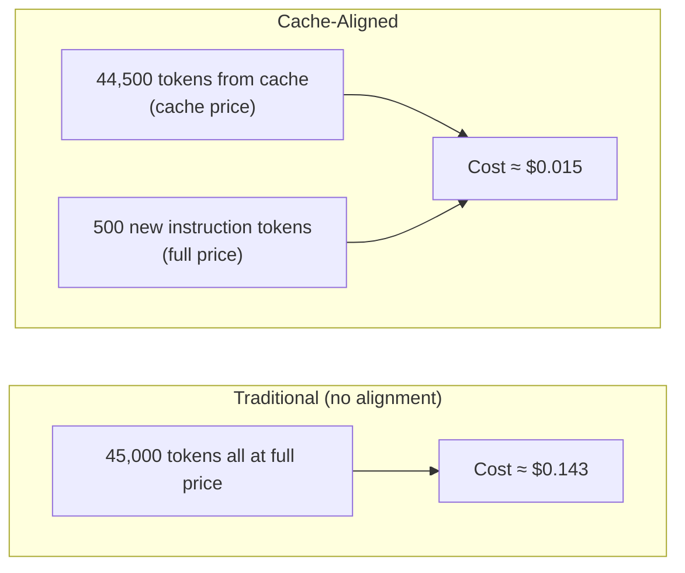
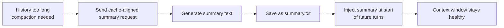

# bash-agent — Cache-Aligned Summarization & Dynamic Compaction

> Source: <https://github.com/lloydzhou/bash-agent/wiki> (cloned from
> `bash-agent.wiki.git`, context-related pages, verbatim)
> Fetched: 2026-06-26

Context-related pages reproduced here:
1. [Cache-Aligned Summarization](#cache-aligned-summarization)
2. [Dynamic Compaction Decision: When to Compact and How Much to Keep](#dynamic-compaction-decision-when-to-compact-and-how-much-to-keep)
3. [EN Course 06 — Compaction and Long Sessions](#compaction-and-long-sessions)

---

# Cache-Aligned Summarization

## 1. Why Context Compaction Matters

bash-agent is an AI agent built for long-running autonomous work. Each conversation turn—user messages, model responses, tool call results—is recorded as part of the **conversation history**.

The problem: history never shrinks on its own. As the conversation grows, two real-world issues emerge:

- **Finite context window**: Every LLM has a maximum context length; once history exceeds that limit, the model stops working properly.
- **Rising costs**: Each API call re-submits the entire history. Even if large portions are duplicated, the provider charges full input price for every token.

To stay within these limits, bash-agent periodically **compacts** the history—distilling long exchanges into a concise summary that replaces the raw old messages in future requests.

## 2. The Hidden Cost of Traditional Summarization

A naive approach: when the history nears the limit, send a dedicated request asking the model to "summarize the conversation above". But this summary request itself isn't free; you still have to resend the messages being compacted.

If the structure of this summary request differs from the normal chat requests, those historical messages **won't hit the API's prompt cache**—they'll all be charged at the full input price.

A quick calculation: compacting 45,000 tokens of history with a dedicated uncached request costs roughly **$0.143** (Claude pricing). That's like buying an expensive energy-saving bulb whose price exceeds the electricity it saves.

## 3. The Key Weapon: LLM Prompt Caching

Many LLM APIs (Anthropic Claude, OpenAI) support **Prompt Caching**. The principle is straightforward:



In bash-agent, every normal chat request starts with the **same system prompt and tool definitions**, so this shared prefix consistently hits the cache across turns—keeping costs extremely low.

## 4. Core Idea of Cache-Aligned Summarization

The idea follows naturally: **make the summary request look as much like a normal chat request as possible**, so it "rides" the cache that already exists.

The implementation boils down to one rule: **don't alter the request structure; simply append a short "please summarize" instruction at the end of the normal conversation messages.**

This means the token makeup of a summary request looks like this:



- The first two parts were already sent in earlier normal requests, so the API serves them from the cache at the drastically lower cache price (usually ~10% of the full input price).
- Only the appended summary instruction is new and must be paid at the full input price—but it's usually just a few hundred tokens.

Crucially, **the system prompt is never changed**. Modifying the system prompt would break the shared prefix, invalidating the cache from the very first token and wiping out all savings.

## 5. Cost Comparison

Compacting 45,000 tokens as an example:



Cache alignment cuts the cost of a single compaction by roughly **90%**. This means bash-agent can compact aggressively and often, keeping the context window healthy without worrying that the compaction itself will eat the savings.

## 6. Saving and Reusing the Summary

Once the compaction finishes, the generated summary text is saved. In every subsequent turn, it's injected at the very beginning of the prompt, so the model sees "what happened before" without the full, verbose history.



The summary itself becomes part of the shared prefix for future requests, continuing to benefit from the same prompt caching—no additional cache-breakage cost is introduced.

## 7. Summary

Cache-Aligned Summarization is bash-agent's strategy for cost-efficient context compaction. It leverages the LLM API's existing prompt caching with a simple, elegant approach:

- **Keep the request structure unchanged** — the summary request shares the exact same prefix as normal chats.
- **Only append a brief instruction** — the only full-price tokens are the short "please summarize" line.
- **~90% cost reduction** — compaction becomes cheap enough to run frequently without hesitation.
- **The system prompt stays stable** — preserving the cache chain and maximizing long-term savings.

With this design, bash-agent can maintain a manageable context size during long, multi-turn autonomous tasks, without letting the cost of compaction eat up the benefits.

> For more details see the [bash-agent project](https://github.com/lloydzhou/bash-agent) and the [original README section](https://github.com/lloydzhou/bash-agent/blob/main/README.en.md#cache-aligned-summarization-1).

---

# Dynamic Compaction Decision: When to Compact and How Much to Keep

## 1. Beyond Simple Thresholds

Most AI coding agents compact context with a straightforward rule: **when the token count exceeds a threshold, summarize and keep the last N messages**. That is simple, but it misses three costs that matter in long sessions:

- **Compaction itself costs money**: the summary call still consumes input and output tokens.
- **Compaction changes the cache prefix**: the new summary plus retained messages introduce a one-time cache miss cost.
- **Long context can hurt quality**: keeping everything may preserve details, but long prompts can make the model miss relevant information in the middle.

bash-agent uses a cache-aware DP economics model. On each compaction check it answers two questions:

1. **Is compaction worth doing?**
2. **If yes, how many recent conversation lines should be retained?**

If every candidate has non-positive net benefit, compaction is skipped. When compaction is forced, for example near the context limit or by PlanClear / PlanConfirm, the same turn-aligned retention policy is used as a fallback.

## 2. Decision Variable

The model enumerates **k**, the number of recent conversation JSONL lines to retain. For every candidate k it estimates:

- $K$: tokens in the retained recent $k$ lines.
- $H$: old history tokens that would be replaced by the summary.
- $T$: total estimated tokens in the conversation file.

The model chooses the highest positive net benefit and then moves the cut point back to a user-message boundary so it never truncates the middle of an assistant/tool segment.

## 3. Current 5-Term Net Benefit Formula

The model computes five terms:

$$
\begin{aligned}
\text{NetBenefit}(k) &=
  \underbrace{\frac{(R - 1) \cdot P_{\text{cache}} \cdot H}{10^6}}_{①\;\text{future savings}} \\
&\quad -\underbrace{\frac{(S + K) \cdot (P_{\text{input}} - P_{\text{cache}})}{10^6}}_{②\;\text{cache miss}} \\
&\quad -\underbrace{\frac{P_{\text{cache}}(V + H) + P_{\text{input}} \cdot L_{\text{instr}} + P_{\text{out}} \cdot S}{10^6}}_{③\;\text{compaction request cost}} \\
&\quad -\underbrace{\frac{\beta \cdot (1 - r_t) \cdot R \cdot \text{avg} \cdot P_{\text{input}}}{10^6}}_{④\;\text{information distortion penalty}} \\
&\quad +\underbrace{Q \cdot P_{\text{input}} \cdot \frac{(V + T)^2 - (V + K)^2}{M \cdot 10^6}}_{⑤\;\text{quality improvement savings}}
\end{aligned}
$$

Where:

- $E$: expected remaining user-input turns. By default it is estimated from `DP_BASELINE_E - current_turn_count` with a floor; `DP_E_FIXED` can force a fixed value.
- $L$: average LLM calls per user input. `DP_L=0` auto-estimates it from `agent_request_count / current_turn_count`; otherwise it uses the configured value.
- $R = E \times L$: expected remaining LLM calls.
- $\text{avg}$: average input tokens per LLM request, estimated from cumulative stats, defaulting to 4000.
- $r_t = \max(r^{c+1}, 0.37)$: cumulative retention after this compaction, with a floor to avoid runaway penalties.
- $M$: max context tokens from `MAX_CONTEXT_TOKENS`, default 200000.
- $Q$: `DP_QUALITY_PENALTY`, default 0.2.

## 4. What Each Term Means

### 4.1 ① Future Savings

$$
\text{①} = (R - 1) \cdot P_{\text{cache}} \cdot H / 10^6
$$

After compaction, later requests carry $H$ fewer old-history tokens. Those tokens are usually already in the provider prompt cache, so the savings are priced at $P_{\text{cache}}$.

### 4.2 ② Cache Miss

$$
\text{②} = (S + K) \cdot (P_{\text{input}} - P_{\text{cache}}) / 10^6
$$

After compaction, the prefix becomes "new summary + retained recent messages". That prefix is new on the next request, so the model accounts for the difference between full input price and cached input price.

### 4.3 ③ Compaction Request Cost

$$
\text{③} = [P_{\text{cache}}(V + H) + P_{\text{input}}L_{\text{instr}} + P_{\text{out}}S] / 10^6
$$

The summary call reuses the normal request prefix. The fixed prefix $V$ and dropped history $H$ are mostly charged at cache-hit price; only the appended summary instruction, about $L_{\text{instr}}=70$ tokens, is full-price input. The summary output $S$ is charged at output price.

### 4.4 ④ Information Distortion Penalty

$$
\text{④} = \beta \cdot (1 - r_t) \cdot R \cdot \text{avg} \cdot P_{\text{input}} / 10^6
$$

Summaries lose detail. The implementation estimates the loss using cumulative retention after this compaction, $r_t=\max(r^{c+1},0.37)$, and scales it by the expected future token volume $R \times \text{avg}$.

### 4.5 ⑤ Quality Improvement Savings

$$
\text{⑤} = Q \cdot P_{\text{input}} \cdot \frac{(V + T)^2 - (V + K)^2}{M \cdot 10^6}
$$

This is the newer positive term. It models the fact that very long contexts degrade answer quality. Compacting shortens the working context from $V+T$ to $V+K$, reducing the expected cost of retries, misses, and corrections. Because it is an incremental improvement, it is added to the net benefit.

## 5. Parameters

| Parameter | Default | Description |
|-----------|---------|-------------|
| `DP_P_INPUT` | `3.0` | Uncached input price, $/MTok |
| `DP_P_CACHE` | `0.30` | Cache-hit input price, $/MTok |
| `DP_P_OUT` | `15.0` | Output price, $/MTok |
| `DP_V` | `5000` | Fixed prefix tokens: system prompt, tools, old summary, etc. |
| `DP_S` | `500` | Estimated summary output tokens |
| `DP_L` | `0` | Average LLM calls per user input; 0 means auto-estimate |
| `DP_BASELINE_E` | `8` | Baseline expected remaining user-input turns |
| `DP_E_FIXED` | `0` | Fixed E override; values greater than 0 skip dynamic estimation |
| `DP_R` | `0.8` | Single-summary information retention rate |
| `DP_BETA` | `0.03` | Information distortion penalty coefficient |
| `DP_QUALITY_PENALTY` | `0.2` | Long-context quality decay penalty coefficient |
| `DP_MIN_KEEP_RATIO` | `0.12` | Minimum ratio of message lines to retain |
| `MAX_CONTEXT_TOKENS` | `200000` | Max context limit, used for forced compaction and quality-term normalization |

## 6. Implementation Details

- Per-line tokens are approximated as `(byte_length + 3) / 4 + 1`.
- `min_keep` keeps at least 3 lines and respects `DP_MIN_KEEP_RATIO`.
- The model evaluates every `k ∈ [min_keep, NR]`.
- Automatic compaction only happens when `best_benefit > 0`.
- The chosen cut point is moved back to a user-message boundary.
- Context above 90% of the limit, `plan_clear`, and `plan_confirm` can force a fallback compaction.

## 7. Summary

The bash-agent compaction model is not simply "compact when over threshold". It weighs:

- cache-priced savings from dropping old history;
- one-time cache invalidation from the new summary prefix;
- the summary request cost itself;
- information loss from repeated summarization;
- quality gains from shortening an overlong context.

This avoids compacting repeatedly near the boundary while still compacting more aggressively when the working context itself is likely hurting answer quality.

> **Related article:** [Cache-Aligned Summarization](https://github.com/lloydzhou/bash-agent/wiki/Cache-Aligned-Summarization)
> **Source code:** [`compact_dp.awk`](https://github.com/lloydzhou/bash-agent/blob/main/src/awk/compact_dp.awk), [`agent.sh`](https://github.com/lloydzhou/bash-agent/blob/main/src/agent.sh)

---

# Compaction and Long Sessions

> EN Course 06

Long sessions need compaction, but compacting too early can waste tokens and break cache reuse. bash-agent treats compaction as an economic decision instead of a simple threshold.

```bash
agent_compact_context() {
    local trigger=${1:-auto} total_lines keep_lines drop tmp_dropped dropped_messages summary_response
    keep_lines=$(store_conv_dp_decision \
        "$(store_stats_get current_turn_count)" "$(store_stats_get agent_request_count)" \
        "$(store_stats_get compact_request_count)" "$(store_stats_get total_input_tokens)") || true
    [[ -n "$keep_lines" ]] || keep_lines=0
    total_lines=$(store_conv_line_count)
    # drop old lines, summarize them, keep recent turns
}
```

## Cache-Aligned Summary

Summary requests reuse the same system prompt and tool prefix shape. That keeps provider cache hits high even when older conversation lines are compacted.

The summary output is written to `summary.txt`, then included in later system prompts as stable context.

## Dynamic Decision

The DP model balances:

- future cache savings
- cache miss cost
- summary generation cost
- information loss
- long-context quality penalty

For the full formulas, see:

- [Cache-Aligned Summarization](Cache%E2%80%90Aligned-Summarization)
- [Dynamic Compaction Decision](Dynamic-Compaction-Decision:-When-to-Compact-and-How-Much-to-Keep)

## Practical Trigger Examples

The decision is data-driven. A few simplified examples:

| Situation | Observed signal | Expected action |
| --- | --- | --- |
| Short fresh session | low total input tokens, low turn count | do not compact |
| Long session with repeated cache misses | high tokens, miss cost growing | compact old turns and keep recent lines |
| Long session but high cache reuse | high tokens, stable cache hits | delay compaction |

`store_conv_dp_decision` computes a keep-window (`keep_lines`) from current stats instead of using a fixed threshold.

## Prompt Shape Before/After Compaction

Compaction drops old conversation lines, but keeps the outer prompt shape stable:

```text
[system sections]
[instruction-files]
[summary]
[recent conversation window]
[current user input]
```

The key invariant is structural consistency. Only the summary body and recent window content change.

## Failure and Fallback

If summary generation fails, runtime safety still comes first:

- keep running the current turn without injecting a broken summary
- preserve recent conversation lines as the minimum working context
- retry compaction later when conditions are better

This fallback avoids corrupting context while still allowing long sessions to proceed.
