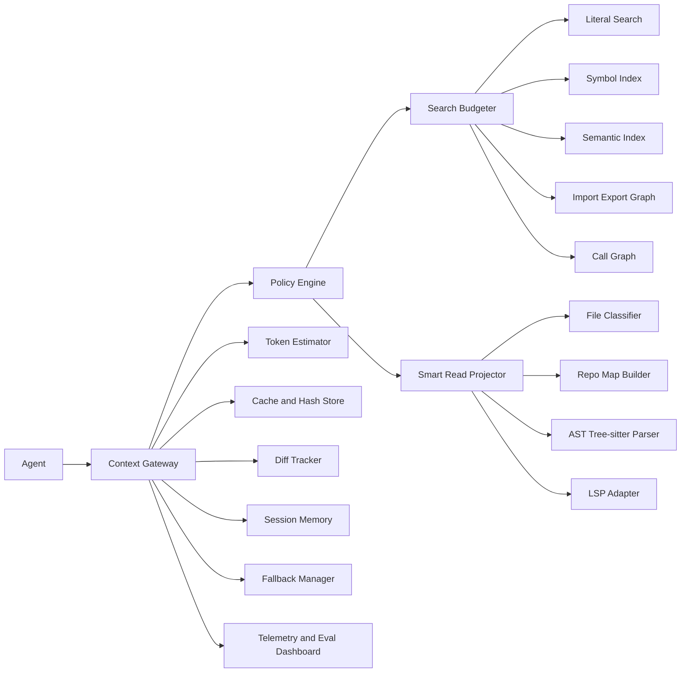

# Token Guard Architecture for Low-Token Local Coding Agents

## Executive summary

The dominant token sink in local coding agents is not the final answer. It is exploratory context: repeated search output, repeated file reads, repeated re-feeding of prior tool output, noisy logs, and broad repository scans that stay in the conversation history. A recent token-consumption study on agentic coding tasks found that agentic coding can consume roughly **1000 times** more tokens than code chat or code reasoning, that **input tokens** dominate total cost, and that repeated runs of the same task can differ by up to **30 times** in total token usage. FastContext’s trajectory analysis reaches the same operational conclusion from another angle: **reading and searching dominate prompt-token usage before the first edit**. [cite: turn7view5, turn8view1]

Across the strongest systems in this space, the winning pattern is not generic compression. It is **structured evidence selection**. Aider uses a repo map so the model sees signatures and key symbols before it reads files. Serena pushes navigation and editing to the **symbol level** via LSP or JetBrains analysis. codesearch makes **metadata-first retrieval** the default and requires a second `get_chunk` call for full code. CodeGraph and Codebase-Memory replace broad scan-read loops with **graph queries** over precomputed code structure. FastContext separates **exploration** from **solving** and returns only compact file-line citations to the main model. Sourcegraph’s Cody papers and posts describe context retrieval as a two-stage **retrieve-then-rank** engine fed by complementary sources such as keyword search, semantic search, and code graphs. [cite: turn16view1, turn14view1, turn20view2, turn20view4, turn17view3, turn17view4, turn7view3, turn8view1, turn13view1, turn12view1, turn12view2]

For `tg`, that implies a clear design direction: do **not** behave like a lossy text compressor that summarizes everything. Instead, become a **retention-first Evidence Projection layer** that sits between tool output and agent context. The layer should transform raw outputs into the smallest truthful evidence needed for the **next action**, while preserving a safe path to exact code when the task changes from understanding to editing. The highest-value workflow change is:

`repo map → hybrid candidate search → metadata-first results → symbol/range read → exact edit window → diff-only or failure-only verification`

rather than:

`grep → read file → grep again → read more files → inspect diff → read tests → retry`. This overall direction is strongly aligned with Aider, Serena, CodeGraph, Codebase-Memory, FastContext, codesearch, CocoIndex, and Sourcegraph’s context-engine design. [cite: turn16view1, turn14view1, turn17view3, turn7view3, turn8view1, turn20view2, turn31view0, turn13view1]

The minimum viable implementation for real savings is smaller than a full knowledge graph. Build, in order: a file classifier, a token estimator, a lightweight repo map, a symbol/outline extractor based on Tree-sitter, a duplicate-read cache, a search budgeter, and a `smart_read` projector that can return outlines, imports/exports, symbol bodies, exact ranges, test-failure slices, and diff-only verification windows. Tree-sitter is a good base for this because it is an incremental parsing library that can update syntax trees efficiently as files change, and multiple projects in this landscape rely on it for AST-aware chunking, tagging, and code navigation. [cite: turn33view0, turn33view1, turn16view1, turn20view1, turn31view0]

The long-term architecture should selectively add LSP-backed symbol resolution, semantic search, import/export and call graphs, and session memory. But the most important design rule stays constant: **editing context must be exact, verification context can often be diff-only, and understanding context can be structurally compressed**. That distinction is the difference between safe token reduction and silent task failure. Repomix’s compression guide is useful here as a cautionary example: structural compression can preserve signatures and types while dropping implementations, which is valuable for architecture and patterns, but it is explicitly experimental and unsuitable as the default representation for exact edits or debugging logic. [cite: turn30view1, turn30view2, turn30view3]

## Token cost model

**Token cost model.** In local coding agents, token spend typically comes from eight buckets: fixed system and tool instructions; the user prompt; conversation history; search output; file reads; repeated reads or repeated search output; command, test, and build logs; and git-oriented context such as `diff`, `status`, and `log`. Across recent trajectory analyses, the most expensive buckets are the exploratory ones, because they are large and because they are re-sent in later turns as part of the accumulated prompt. The load-bearing insight for `tg` is that reducing a single broad search or read often saves tokens twice: once now, and again on every later turn that would otherwise re-feed it. [cite: turn7view5, turn8view1, turn17view4]

**Most reducible components.** The safest and largest reductions are usually available in noisy tool outputs rather than in code that is about to be edited. Build and test logs are especially compressible because much of their volume is repeated stack frames, progress bars, dependency noise, successful test output, or duplicated warnings. Broad grep output is another prime target; FastContext, CodeGraph, and Codebase-Memory all exist because file-by-file repository exploration burns tokens quickly. Aider’s repo map, Probe’s `--max-tokens`, codesearch’s metadata-first search, and FastContext’s compact file-line citations all converge on the same principle: **summarize search first, read later, and cap context at the search stage**. [cite: turn7view3, turn17view3, turn16view1, turn21view1, turn20view2, turn7view1]

**Risky components.** Exact edit context is risky to compress. If the agent is about to modify code, it needs literal source, stable line numbers or anchors, and enough exact surrounding code to maintain syntax and invariants. Serena’s symbol-replace tools and codesearch’s separate `get_chunk` step both embody this distinction: navigation can be abstract, editing cannot. The same is true for debugging context when a single flag, regex, literal path, environment variable, or schema field matters; lossy summarization is dangerous if it removes the exact triggering value. Repomix’s compression is suitable for “understanding code patterns and signatures,” but not as a universal replacement for literal code reads. [cite: turn14view1, turn14view2, turn20view4, turn30view2]

**Conversation history is a hidden multiplier.** The recent token-economics paper emphasizes that agentic tasks are expensive largely because input tokens dominate the budget. FastContext’s design responds to that directly by moving exploration into a separate component so the main solver does not accumulate irrelevant scans in its own history. `tg` should adopt the same philosophy even if it is not a separate model: exploration outputs should be compact, typed, and deduplicated before they enter the main conversation at all. [cite: turn7view5, turn8view1]

**Metrics `tg` should collect.** The following telemetry set is sufficient to evaluate both savings and safety:

| Metric | Definition | Why it matters |
|---|---|---|
| `raw_bytes` | Raw tool-output bytes before projection | Baseline size |
| `estimated_raw_tokens` | Model-specific token estimate before projection | True savings denominator |
| `filtered_bytes` | Bytes after projection | Compression ratio |
| `estimated_filtered_tokens` | Model-specific token estimate after projection | Main optimization target |
| `input_tokens` | Actual provider-reported prompt tokens when available | Ground truth cost |
| `output_tokens` | Provider-reported completion tokens | Usually secondary cost |
| `cached_input_tokens` | Provider-reported cached prompt tokens | Distinguish cheap replay from real waste |
| `uncached_input_tokens` | Input minus cached input | Best measure of avoidable cost |
| `tool_calls` | Number of external tool invocations | Proxy for exploration churn |
| `file_reads` | Count of read-like operations | Core waste source |
| `duplicate_reads` | Reads whose effective file hash and selector were already seen in-session | Direct waste signal |
| `search_calls` | Count of search-like operations | Search discipline |
| `search_result_usefulness` | Whether a search result led to a follow-up read, edit, or verification action within the next few steps | Quality of retrieval, not just quantity |
| `distinct_files_touched` | Unique files surfaced to the agent | Context sprawl |
| `repeated_file_reads` | Same file read multiple times | Dedup opportunity |
| `repeated_range_reads` | Same file+range read multiple times | Range cache value |
| `repeated_symbol_reads` | Same symbol read multiple times | Symbol cache value |
| `success_rate` | Task completion correctness rate | Do not trade away task quality |
| `task_latency` | End-to-end wall-clock time | Compression that slows work too much is not useful |
| `fallback_rate` | Share of projections escalated to full or exact reads | Safety-pressure indicator |
| `omission_bug_rate` | Failures caused by missing facts in projected context | Core safety metric |

**Operational definitions.** `search_result_usefulness` should not be a subjective thumbs-up. Define it mechanically: a search is useful if one of its top returned candidates is subsequently read, edited, appears in the final diff, or is named in the final answer within the next `k` tool actions. `duplicate_reads` should be keyed by `(normalized_path, selector_type, selector_value, file_hash)`, so the system can distinguish “same path after change” from “same path unchanged.” For model families that do not expose tokenizer APIs locally, `tg` should maintain pluggable token estimators and calibrate them against provider telemetry, because byte count alone is not reliable enough for fine-grained budgeting. This estimator should be model-aware, not global.

## Landscape comparison

**Project-by-project comparison.**

| System | Core idea | Index / retrieval | What it returns to the agent | Token-saving move | Strong fit | What `tg` should copy | What `tg` should avoid | Sources |
|---|---|---|---|---|---|---|---|---|
| **CodeGraph** | Local-first pre-indexed code knowledge graph for MCP clients | Tree-sitter extraction into SQLite + FTS5; reference resolution; graph traversal for callers/callees/impact | Graph answers and focused context rather than scan-read loops | Replaces grep/read discovery with graph queries; project benchmarks report large token and tool-call reductions | Architecture questions, call chains, structural exploration | Graph-backed structural queries; file watcher; “sufficient answer should stop reads” principle | Heavy graph work before MVP; do not depend on agent behavior change alone | [cite: turn17view1, turn17view2, turn17view4, turn28view1] |
| **CocoIndex-code** | Lightweight semantic code-search CLI/MCP for agents | Embedded semantic index; returns matching code chunks with scores; background daemon | Chunked search hits with path, language, code, line numbers, similarity score | Search narrows the read set; claimed 70% token savings are project-published, not independently verified here | Conceptual search, unfamiliar codebases | Semantic search entrypoint; local daemon; agent skill that refreshes index automatically | Search-only worldview; chunk results alone are not enough for exact editing | [cite: turn19view3, turn19view4, turn18view6] |
| **CocoIndex** | Incremental indexing engine for always-fresh context | Syntax-aware Tree-sitter chunking; memoized delta-only recompute; vector index targets | Fresh chunks and embeddings kept in sync as code changes | Makes indexing cheap enough to stay fresh; one-line edit can re-embed one chunk instead of the repo | Always-warm local indexes | Delta-only indexing; reuse unchanged chunks; shared indexing/query embedder | External DB assumptions for MVP; overbuilding beyond single-repo local use | [cite: turn18view4, turn31view0] |
| **Serena** | IDE-like semantic retrieval and editing over MCP | LSP backend or JetBrains plugin; symbol/ref/type-hierarchy tools | Symbol overviews, references, declarations, implementations, symbol-body edits | Operates at symbol level without reading whole files; symbolic editing is explicitly described as token-efficient | Search, read, edit, refactor | Symbol-first navigation; exact symbol editing; use IDE/language intelligence when available | Requiring deep LSP coverage across all languages in version one | [cite: turn14view0, turn14view1, turn14view2] |
| **Aider with repo map** | Concise whole-repo map of important symbols and signatures | Tree-sitter symbol extraction plus graph ranking to fit a token budget | Ranked repo map, then exact files added when needed | Gives architecture context with signatures instead of whole-file reads; defaults to a bounded map budget | Large-repo orientation, high-level context | Repo map before reads; budgeted map; importance ranking over definitions/references | Manual file-add dependence; repo map is not a substitute for exact edit windows | [cite: turn6view5, turn16view0, turn16view1, turn29view0] |
| **codesearch** | Fully offline hybrid semantic code search MCP server | Vector ANN + BM25 fused by RRF; Tree-sitter AST chunking; symbol index; dependency graph | Metadata by default; full code only via `get_chunk`; outline, similar chunks, impact | Explicit metadata-first contract; compact mode first, exact retrieval second | Search-heavy workflows, multi-repo search, symbol navigation | Hybrid retrieval; metadata-first default; explicit second step for full chunks | Multi-repo and ANN complexity in MVP; narrower graph depth than a full code graph | [cite: turn20view2, turn20view4, turn20view3] |
| **Probe** | Zero-setup AST-aware reading and search engine with built-in agent | Boolean/BM25/hybrid search; AST structural query; extract by line/symbol; symbols list | Complete AST blocks, symbols, extracts, query matches | Token budgets and session dedup; extract exactly the block you need; can parse compiler output into extracts | Search, exact block extraction, debugging by failure lines | Query-before-read; exact block extraction; max-token budgets; session dedup | Probe’s claim that agents do not need embedding search should be treated as a project position, not a universal rule | [cite: turn6view7, turn21view0, turn21view1, turn21view4] |
| **Repomix with code compression** | Packs a repository into one AI-friendly file; optional Tree-sitter compression | Whole-repo packing; compression preserves signatures/types and removes implementations | Entire packed repo or structurally compressed code | Useful for architecture overviews and high-level pattern reading | Documentation, architecture snapshots, offline sharing | Structural compression as a mode, not a default | Whole-repo dumps in the normal loop; lossy compression for edit/debug paths | [cite: turn6view8, turn30view1, turn30view2, turn30view3] |
| **Continue** | Agent framework with tools, rules, and MCP extensibility | Legacy `@Codebase` used embeddings + keyword search; current docs emphasize tools, rules, MCP, and optional custom RAG with reranking | Tool-driven exploration, rules, or custom-MCP retrieval | Rules and external retrieval let teams avoid pushing too much context directly into prompts | Policy, custom retrieval integration | Repository-local rules; pluggable MCP; reranking guidance | Relying on generic built-in file/search tools without stronger anti-waste policy | [cite: turn26view0, turn26view1, turn26view2, turn26view3] |
| **Roo Code** | Multi-mode agent in editor, supports MCP and project rules | Tooling is broad; modes and AGENTS files shape behavior | Mode-specific behavior, MCP access, generated AGENTS guidance | Not a retrieval engine by itself; value is mainly policy shaping | Policy scaffolding, mode-aware prompts | Mode-specific AGENTS files; concise project-specific rule generation | Treating “modes” as a substitute for retrieval/index design | [cite: turn23view0, turn23view1, turn23view2] |
| **Sourcegraph Cody** | Context engine with retrieve-then-rank pipeline and multiple context lenses | Keyword, semantic, natural-language, and code-graph sources; ranking stage; enterprise multi-repo retrieval later tied into core search engine | Ranked context items for prompts | Retrieval and ranking are explicit stages; complementary sources are encouraged | Full-spectrum retrieval design, evaluation methodology | Retrieve-then-rank; complementary retrieval sources; separate retrieval evaluation from full-system evaluation | Enterprise-scale backend assumptions; very broad context surface for local MVP | [cite: turn13view1, turn12view1, turn12view2, turn10search2] |
| **SCIP** | Language-agnostic protocol for code intelligence indexes | Standardized symbol/reference/implementation index format | Exact navigation results for defs/refs/impls | Avoids text search for symbol navigation if index exists | Definitions, references, impact, exact language intelligence | Treat SCIP as an optional precision layer | Hard dependency for MVP; not every language/local repo will have an indexer ready | [cite: turn24view0, turn24view1, turn24view4] |
| **FastContext** | Dedicated repository-exploration subagent separate from the main solver | Read-only exploration using read/glob/grep; parallel tool calling; trained explorer models in research version | Compact file-line citations as focused evidence | Separates exploration from solving; main-agent token use drops substantially in reported experiments | Pre-edit exploration, large-repo discovery | Exploration/solving separation; compact citation outputs; parallel search/read stage | Requiring a trained custom submodel in the first product version | [cite: turn7view1, turn8view1, turn8view2] |

**Research findings that most matter for `tg`.**

| Paper | Verified finding | Implication for `tg` | Sources |
|---|---|---|---|
| **How Do AI Agents Spend Your Money?** | Agentic coding is far more expensive than code chat/reasoning; input tokens dominate; run-to-run token use is highly stochastic and more spend does not guarantee better accuracy | Measure prompt-side costs precisely; optimize exploration and repetition first; benchmark with multiple runs and medians | [cite: turn7view5] |
| **SWE-Pruner** | Task-aware pruning can cut agent-task tokens by 23–54% with minimal or positive impact, outperforming generic compression approaches that ignore code structure | Compression should be task-aware and goal-aware, not purely statistical | [cite: turn7view6] |
| **SWE-ContextBench** | Correctly summarized and retrieved prior experience can improve accuracy and reduce runtime/token cost, while incorrect or unfiltered context can hurt | Session memory should be selective, typed, and retrievable—not a raw transcript dump | [cite: turn27view1, turn27view3] |
| **Codebase-Memory** | Persistent Tree-sitter knowledge graphs answer structural questions with about 10x fewer tokens and fewer tool calls than file-exploration agents | Graph-native queries are a major long-term opportunity for structural tasks | [cite: turn7view3, turn7view4] |
| **FastContext** | Delegated exploration with compact citations can improve end-to-end scores while reducing main-agent token consumption by up to about 60% in reported settings | Separate exploration from solving, even if only logically at first | [cite: turn8view1, turn8view2] |
| **RepoCoder** | Iterative retrieval-generation beats both in-file baselines and naive one-shot retrieval for repository-level completion | Retrieval should be iterative and budgeted, not one giant fetch | [cite: turn7view8] |
| **CodeSearchNet Challenge** | Semantic code search is a distinct retrieval problem with vocabulary mismatch between code and natural language; benchmark corpus spans about 6 million functions | Keep semantic search in the architecture; literal search alone will miss concept-level queries | [cite: turn7view9] |

**Adjacent projects worth monitoring, clearly separate from the required list.** Two recent open-source systems reinforce the same architecture trend. `code-review-graph` is a newer structural-map system for review workflows that claims substantial token reductions on its own published evaluations, but those numbers are project-published rather than peer-reviewed. `codebase-memory-mcp` is the implementation line adjacent to the Codebase-Memory paper, and its official site emphasizes persistent local knowledge-graph queries over file-by-file reading. These are useful directional signals, but their benchmarks should be treated more cautiously than the paper-backed findings above. [cite: turn32search1, turn32search0, turn25search1]

## Search reduction design

**Unified patterns.** The shared pattern across Aider, Serena, codesearch, CodeGraph, Codebase-Memory, FastContext, Sourcegraph Cody, and CocoIndex is a staged retrieval pipeline:

1. **Cheap global structure first** through a repo map, symbol table, or graph.
2. **Candidate generation** using one or more complementary search methods.
3. **Metadata-first evidence** such as paths, symbols, signatures, line ranges, and scores.
4. **Escalation only on demand** to exact symbol bodies, line ranges, or edit windows.
5. **No re-reading of unchanged evidence** within the same session. [cite: turn16view1, turn14view0, turn20view2, turn17view3, turn7view3, turn7view1, turn13view1, turn31view0]

That makes the following pattern classes clear.

**Essential patterns.** Metadata-first retrieval, repo map before full-file read, symbol-level navigation, AST-aware chunking, hybrid search, line-range reads, edit windows, diff-only verification, generated-file suppression, and cache/deduplication are the core set. These recur in different forms across Aider, Serena, codesearch, Probe, CocoIndex, FastContext, and Cody. They should be in `tg` version one or version one-point-something. [cite: turn16view1, turn14view1, turn20view2, turn21view1, turn31view0, turn8view1, turn13view1]

**Optional patterns.** Full call-graph traversal, community detection, cross-repo search, and ML-trained exploration are valuable but not required for immediate savings. Codebase-Memory, CodeGraph, codesearch, and FastContext show why they matter, but they also add implementation cost and language-coverage complexity. They belong in the long-term plan, not the smallest useful `tg`. [cite: turn7view3, turn17view2, turn20view2, turn8view2]

**Dangerous patterns.** Whole-repo packing, default lossy compression of code bodies, and unvalidated semantic summaries are dangerous if used in the normal edit/debug loop. Repomix’s own compression guide says it removes implementations and marks the feature experimental. SWE-ContextBench shows that unfiltered or incorrectly retrieved context can have limited or negative benefits. For `tg`, structural compression must therefore be mode-gated: architecture and understanding, yes; exact edit contexts, no. [cite: turn30view1, turn30view3, turn27view3]

**Best search strategy for `tg`.** Use this routing policy:

- **Do not search at all** when the target symbol or exact file+range was already read exactly and the next action is local edit or verification.
- **Use repo map** when the user asks “where is X implemented?”, “how is Y structured?”, or when the codebase area is still unknown.
- **Use literal search** when the query contains exact identifiers, filenames, error strings, route paths, config keys, SQL text, stack-trace fragments, or CLI flags.
- **Use symbol search** when the query looks identifier-like or the agent already has a likely module/file and wants defs/refs/impls.
- **Use semantic search** when the query is conceptual, paraphrased, or domain-language heavy, and there is no stable literal anchor.
- **Use graph search** after an anchor exists and the task is callers, callees, imports, exports, impact, route-to-service flow, or dependency tracing.
- **Use LSP or SCIP precision** when exact definition/reference resolution is available and the task is rename, refactor, or reference impact.
- **Use no more than one broad candidate-generation step per intent change**. If the intent has not changed, reuse or refine the last candidate set rather than launching another broad search. This directly follows the evidence that repeated exploration is the cost driver. [cite: turn16view1, turn14view1, turn20view2, turn21view1, turn24view1, turn7view5, turn8view1]

**How to avoid broad `rg` output.** `tg` should never pass raw broad grep output through unchanged except as an explicit fallback. Instead, a broad literal search should be projected into grouped candidates with hard limits such as: maximum matches per file, maximum files per result set, maximum characters per snippet, and one merged candidate record per file or per symbol. Probe’s `--max-tokens` and codesearch’s `compact=true` default show the right interaction model: search is a bounded selection stage, not a file-dumping stage. [cite: turn21view1, turn20view2]

**Candidate scoring.** Score candidates with a fusion model, not a single scalar from one retriever. A practical local score for `tg` can combine: literal hit quality, path prior, symbol-name match, repo-map centrality, semantic similarity if available, proximity to files already touched, and graph distance from known anchors. Sourcegraph’s Cody paper emphasizes complementary retrieval sources, while codesearch explicitly uses RRF to fuse vector and BM25 retrieval. This is the right model family for `tg` as well. [cite: turn13view1, turn20view2]

**Confidence exposure.** Expose confidence to the agent in plain structured form: `high`, `medium`, `low`, plus reasons. For example: “high because exact symbol name + declaration match,” or “medium because semantic similarity is high but no literal anchor.” `tg` should not overstate certainty on semantic matches. Low-confidence results should carry an explicit recommended next action such as “run literal search for string X” or “read outline of file Y before editing.”

**Agent-optimized search output format.** The search response should tell the agent exactly what to do next, not just show ranked results:

```json
{
  "queryId": "s-1042",
  "mode": "hybrid",
  "purpose": "locate",
  "summary": "Likely implementation is concentrated in 3 files and 5 symbols.",
  "budget": {
    "rawEstimatedTokens": 4180,
    "returnedEstimatedTokens": 640,
    "suppressionRatio": 0.85
  },
  "candidates": [
    {
      "path": "src/auth/session.ts",
      "symbol": "createSession",
      "range": { "startLine": 42, "endLine": 128 },
      "score": 0.93,
      "confidence": "high",
      "reasons": [
        "exact symbol-name match",
        "called from login route",
        "touched in recent diff"
      ],
      "nextRead": {
        "mode": "symbol",
        "path": "src/auth/session.ts",
        "symbol": "createSession"
      }
    },
    {
      "path": "src/routes/login.ts",
      "symbol": "postLogin",
      "range": { "startLine": 15, "endLine": 66 },
      "score": 0.81,
      "confidence": "medium",
      "reasons": [
        "route literal match",
        "imports auth/session"
      ],
      "nextRead": {
        "mode": "range",
        "path": "src/routes/login.ts",
        "range": { "startLine": 15, "endLine": 66 }
      }
    }
  ],
  "dedupedAgainst": ["s-1039"],
  "fallbackAvailable": true
}
```

That format gives the agent four things broad grep does not: grouped evidence, token accounting, explicit uncertainty, and an exact next read instruction.

## Read reduction design

**Read token reduction design.** The most important design decision for `tg` is to treat “read” as a family of modes, not a single `read_file(path)` primitive. The unit of evidence should be the **smallest truthful slice** needed for the next action. Serena’s symbol-level retrieval, Aider’s map-first approach, codesearch’s metadata-first retrieval with `get_chunk`, Probe’s exact block extraction, Repomix’s structural compression, and FastContext’s file-line citations all point in this direction. [cite: turn14view0, turn16view1, turn20view4, turn21view2, turn30view2, turn7view1]

There are three context classes, and `tg` should treat them differently:

- **Understanding context** can often be compressed or projected.
- **Editing context** must be exact.
- **Verification context** can often be diff-only, hunk-only, or failure-only.

That distinction is the core safety boundary.

**Smart read modes.**

| Mode | Exact | Returns | Use when | Avoid when | Main risk | Fallback |
|---|---|---|---|---|---|---|
| `metadata` | No | path, size, language, hash, file class, generated/lockfile flags, symbol count, import count | First look at unknown files; cap broad exploration | You already know the target lines | Too little detail | `outline` |
| `outline` | Mostly no | top-level symbols, signatures, ranges, docstring heads | Understand file shape, pick next symbol | You need internal logic | Hides control flow details | `symbol` |
| `imports_exports` | Exact for selected lines | imports, exports, requires, route decorators, package refs | Follow dependencies and API surface cheaply | You need business logic | Misses implementation behavior | `symbol` or `range` |
| `symbol` | Yes | exact body of one symbol, signature, docstring, line numbers, hash | Default exact read for functions/classes/methods | No stable symbol anchor exists | Miss surrounding invariants outside symbol | `edit_window` or `range` |
| `range` | Yes | exact line range with anchors | Stack traces, config fragments, known line targets | Range is syntactically incomplete | Missing enclosing structure | `semantic_expand` |
| `semantic_expand` | Yes | exact enclosing block or symbol around a requested line/range | Error line, diff hunk, or trace lands mid-block | Full file is actually needed | Expansion rules can still under-shoot | `edit_window` |
| `structural_compress` | No | imports + signatures + type/interface shells + body placeholders | Architecture understanding, quick API scan | Editing, debugging logic, exact review | Removes logic | `symbol` or `full` |
| `semantic_slice` | Mixed | exact relevant blocks across one or more files with provenance and omitted-region markers | “How does auth flow work?” or “what handles retries?” | Exact edits to those blocks are imminent | Slice may omit hidden dependency | `symbol`/`edit_window` on all participating symbols |
| `edit_window` | Yes | exact target symbol/range plus surrounding anchors, nearby types/imports, optionally one-hop callers/callees | Any code edit | Token budget is too small to make it safe | Window may miss remote invariant | escalate to larger `edit_window`, then `full` |
| `diff` | Yes | touched files, exact hunks, touched symbols, rename map, hunk hashes | Post-edit verification, code review, retry after edit | No diff exists yet | Misses unchanged but relevant context | `symbol` or `range` on neighboring code |
| `test_failure` | Mixed | failing test names, commands, error cluster, stack frames, referenced source/test ranges, concise stderr evidence | Debugging from tests or build failures | Failure parser confidence is low | Parser drops subtle clue | raw log passthrough |
| `json_projection` | Mixed | selected keys/paths, schema shape, array counts, sampled values, matched query keys | Large JSON, configs, manifests | Exact full JSON editing is needed | Omitted key matters | targeted `range` or `full` |
| `markdown_section` | Mixed | headings, selected sections, local anchors | READMEs, design docs, AGENTS, changelogs | Cross-section reasoning depends on the whole doc | Hidden detail in skipped section | wider section or full doc |
| `dependency_projection` | Mixed | package manager, direct deps, queried package version, dependency diffs | `package.json`, lockfiles, workspace manifests | You need exact lockfile lines for edit/verify | Version edge case hidden in omitted entry | targeted `range` |
| `generated_file_suppression` | No | warning, probable source generator/source file, build artifact classification | Minified JS, generated API clients, snapshots, compiled assets | The generated file itself is the task target | Wrong source inference | full read with warning |

**Input parameters, safety rules, and fallbacks.** The interface should make the mode explicit and require a `purpose`. For example, `purpose=understand` can permit `structural_compress`, while `purpose=edit` should reject it and either return `edit_window` or escalate to full exact read. Compression should never be silent. Every non-exact mode should return metadata that says what was omitted, why it was omitted, and how to escalate.

**Logs and diffs deserve first-class read modes.** Probe already shows one useful pattern here: extract from compiler output or specific failure lines instead of reading giant logs raw. For `tg`, PowerShell, `npm`, `pnpm`, `pytest`, `jest`, `vitest`, `go test`, `cargo test`, `tsc`, and `eslint` outputs should be projected into a stable schema with the command, exit code, deduplicated error clusters, the first failing tests, the highest-signal stack frames, and exact referenced file ranges. Large raw logs should be kept on disk and referenced by hash. Only if the parser confidence is low, or the agent explicitly asks for raw stderr, should the original be passed through. [cite: turn21view2, turn21view4]

**Preserving editability while cutting tokens.** This is the non-negotiable rule set:

1. Any context that may be edited must be returned **verbatim**, not summarized.
2. The editable slice must carry a **content hash** and stable anchors.
3. If the slice is smaller than a whole file, it must include enough exact surroundings to preserve syntax, imports, and local invariants.
4. After an edit, verification should default to the **diff** and the specific tests or errors that changed, not to re-reading every touched file.
5. If there is any ambiguity about truncation risk, `tg` should fail open and return more exact code.  

That is the same retention-first philosophy your product statement already wants, and it is consistent with how Serena, codesearch, and FastContext separate cheap navigation from exact code or exact evidence. [cite: turn14view2, turn20view4, turn7view1]

## Protocol, policy, and architecture

**Smart Read protocol.** A concrete `SmartReadRequest` / `SmartReadResponse` protocol for `tg` should look like this:

```ts
export type TgPurpose =
  | "locate"
  | "understand"
  | "edit"
  | "debug"
  | "verify"
  | "architecture";

export type TgReadMode =
  | "auto"
  | "metadata"
  | "outline"
  | "imports_exports"
  | "symbol"
  | "range"
  | "semantic_expand"
  | "structural_compress"
  | "semantic_slice"
  | "edit_window"
  | "diff"
  | "test_failure"
  | "json_projection"
  | "markdown_section"
  | "dependency_projection"
  | "full";

export interface TgLineRange {
  startLine: number;
  endLine: number;
}

export interface TgSymbolSelector {
  name?: string;
  kind?: "function" | "method" | "class" | "interface" | "type" | "variable" | "module";
  fileHint?: string;
}

export interface SmartReadRequest {
  path: string;
  purpose: TgPurpose;
  mode?: TgReadMode;              // default: "auto"
  query?: string;                 // natural-language intent or error text
  symbol?: TgSymbolSelector;
  range?: TgLineRange;
  tokenBudget?: number;
  includeImports?: "none" | "local" | "external" | "relevant";
  includeReferencedTypes?: boolean;
  includeCallers?: boolean | number;   // true => 1 hop, number => N callers
  includeCallees?: boolean | number;   // true => 1 hop, number => N callees
  includeTests?: boolean | "adjacent" | "failing_only";
  includeLineNumbers?: boolean;
  includeHash?: boolean;
  previousReadId?: string;
  includeDiffSincePreviousRead?: boolean;
  allowFullFileFallback?: boolean;     // default: true
  exactRequired?: boolean;             // force exact content
}

export interface TgEvidenceHeader {
  readId: string;
  path: string;
  mode: TgReadMode;
  purpose: TgPurpose;
  exact: boolean;
  fileHash?: string;
  unchangedSincePrevious?: boolean;
  cacheHit?: boolean;
  rawEstimatedTokens: number;
  returnedEstimatedTokens: number;
  omitted?: string[];
  warnings?: string[];
  suggestedNextRead?: SmartReadRequest;
}

export interface SuppressedFullReadResponse extends TgEvidenceHeader {
  kind: "suppressed_full_read";
  reason:
    | "too_large_for_purpose"
    | "generated_file"
    | "lockfile"
    | "binary_or_minified"
    | "duplicate_unchanged_read";
  replacement:
    | "metadata"
    | "outline"
    | "dependency_projection"
    | "json_projection"
    | "generated_file_suppression";
}

export interface OutlineResponse extends TgEvidenceHeader {
  kind: "outline";
  symbols: Array<{
    name: string;
    kind: string;
    signature?: string;
    range: TgLineRange;
    exported?: boolean;
  }>;
}

export interface SymbolBodyResponse extends TgEvidenceHeader {
  kind: "symbol_body";
  symbol: {
    name: string;
    kind: string;
    range: TgLineRange;
    signature?: string;
  };
  content: string; // exact
}

export interface SemanticSliceResponse extends TgEvidenceHeader {
  kind: "semantic_slice";
  slices: Array<{
    path: string;
    range: TgLineRange;
    rationale: string;
    content: string; // exact inside each slice
  }>;
}

export interface EditWindowResponse extends TgEvidenceHeader {
  kind: "edit_window";
  targetRange: TgLineRange;
  anchors: {
    before: string[];
    after: string[];
  };
  imports?: string[];
  referencedTypes?: string[];
  callers?: Array<{ path: string; range: TgLineRange; signature?: string }>;
  callees?: Array<{ path: string; range: TgLineRange; signature?: string }>;
  content: string; // exact editable content
}

export interface DiffOnlyReadResponse extends TgEvidenceHeader {
  kind: "diff_only_read";
  files: Array<{
    path: string;
    status: "added" | "modified" | "deleted" | "renamed";
    hunks: Array<{
      oldRange?: TgLineRange;
      newRange?: TgLineRange;
      content: string; // exact diff hunk
    }>;
    touchedSymbols?: string[];
  }>;
}

export interface UnchangedFileResponse extends TgEvidenceHeader {
  kind: "unchanged_file";
  previousReadId: string;
}

export interface GeneratedFileWarningResponse extends TgEvidenceHeader {
  kind: "generated_file_warning";
  probableSource?: string;
  generatorHint?: string;
}

export interface LockfileProjectionResponse extends TgEvidenceHeader {
  kind: "lockfile_projection";
  packageManager: "npm" | "pnpm" | "yarn" | "bun" | "cargo" | "pip" | "poetry" | "uv" | "other";
  queriedPackages?: Array<{
    name: string;
    version?: string;
    requestedBy?: string[];
  }>;
  directDependencies?: string[];
}

export interface ErrorFallbackResponse extends TgEvidenceHeader {
  kind: "error_fallback";
  errorCode:
    | "path_not_found"
    | "symbol_not_found"
    | "parse_failed"
    | "budget_exhausted"
    | "unsafe_projection";
  fallbackContent?: string;
}

export type SmartReadResponse =
  | SuppressedFullReadResponse
  | OutlineResponse
  | SymbolBodyResponse
  | SemanticSliceResponse
  | EditWindowResponse
  | DiffOnlyReadResponse
  | UnchangedFileResponse
  | GeneratedFileWarningResponse
  | LockfileProjectionResponse
  | ErrorFallbackResponse;
```

**Agent policy design.** Good tools are not enough if the agent keeps using them badly. CodeGraph’s implementation notes are useful here: its maintainers explicitly observe that systems regress the moment graph answers are not “sufficient enough to stop the agent from reading,” and that MCP instructions alone are low-salience compared with the tool contract itself. Aider also warns that adding too many files overwhelms the LLM and costs more tokens. Continue and Roo both use repository-local rules files to shape agent behavior. `tg` should therefore combine **tool design** with a repository-local policy file. [cite: turn28view1, turn16view0, turn26view0, turn23view1]

A strong `AGENTS.md` / system policy for `tg` should be concise and operational:

```md
# Token Guard usage policy

Use `search_project` or `repo_map` before broad file search when the target area is unknown.

Prefer `smart_read(mode=symbol|outline|range|edit_window)` over raw `read_file`.

Do not read whole files unless:
- the file is small, or
- exact multi-symbol editing requires it, or
- `smart_read` explicitly escalates to full.

Treat previously returned `readId` results as already read.
If a file is unchanged, request diff or delta from the previous read.

Do not repeat the same broad search unless the task changed or prior results were low confidence.

Prefer:
- `literal` search for exact strings, errors, routes, config keys
- `symbol` search for identifiers
- `semantic` search for conceptual queries
- `graph` search after locating an anchor symbol/file

After edits, verify with `diff` and failing-test evidence first.
Do not re-read all edited files by default.

Do not send raw lockfiles, generated files, minified files, snapshots, or very large JSON into the model.
Use projection modes for those files.

If `smart_read` marks a response as non-exact, do not edit from that response.
Escalate to `edit_window` or exact `symbol`/`range` read first.

If `tg` reports low confidence or unsafe projection, request fallback rather than guessing.
```

**Recommended `tg` architecture.** The architecture should be a **Context Gateway** that intercepts or wraps tool outputs before they enter agent context, with internal typed services behind it:



**Module roles.**

- **Tool Output Interceptor / Context Gateway.** The only module the agent must trust directly. It receives raw outputs from grep-like tools, file reads, logs, git commands, and custom indexes. It rewrites them into typed, budgeted evidence or passes them through unchanged on fallback.
- **Token Estimator.** Tracks raw vs filtered size, provider telemetry, cached vs uncached estimates, and session totals.
- **File Classifier.** Decides whether a file is source code, test, config, lockfile, generated file, minified file, large JSON, markdown, binary, or log.
- **Search Budgeter.** Routes queries across literal, symbol, semantic, graph, or repo-map stages and enforces result set caps.
- **Smart Read Projector.** Implements the read modes above.
- **Repo Map Builder.** Lightweight summary of file paths, top-level symbols, exports, and centrality scores.
- **AST / Tree-sitter Parser.** Core local structural layer. Tree-sitter’s incremental parsing model makes it practical for always-on local use. [cite: turn33view0]
- **Symbol Index.** Supports outline, symbol lookup, references by local static approximation, and exact symbol read.
- **Import/Export Graph.** Cheap, high-value graph for module flow and dependency narrowing.
- **Call Graph.** Useful later, but only after AST and symbol extraction are stable.
- **LSP Adapter.** Optional precision layer for exact defs/refs/rename impact in languages with strong support.
- **Semantic Index.** Optional but valuable for concept-level search; start with embeddings over AST chunks, not arbitrary line chunks.
- **Cache / Hash Store.** Keyed by file hash, symbol hash, read selector, and previous read id.
- **Diff Tracker.** Supports unchanged-file responses and diff-only verification.
- **Session Memory.** Stores structured evidence of what was already surfaced. SWE-ContextBench strongly suggests that this memory must be selective, not raw. [cite: turn27view1, turn27view3]
- **Policy Engine.** Encodes task-phase rules and escalation ladders.
- **Fallback Manager.** Handles retention-first failure-open behavior.
- **Telemetry / Evaluation Dashboard.** Makes savings and omission bugs visible.

**Implementation roadmap.**

**Build first.**  
Start with the modules that directly cut search/read waste without requiring heavyweight indexing:

1. Context Gateway  
2. Token Estimator  
3. File Classifier  
4. Cache / Hash Store  
5. Diff Tracker  
6. Tree-sitter-based Outline / Symbol extractor  
7. Repo Map Builder  
8. Smart Read Projector for `metadata`, `outline`, `imports_exports`, `symbol`, `range`, `edit_window`, `diff`, `test_failure`, `json_projection`, `dependency_projection`

This is the minimum set that can already transform repeated full reads into selective exact reads.

**Build second.**  
Add the capabilities that improve candidate quality and reduce unnecessary reads further:

1. Search Budgeter  
2. Literal search projector  
3. Symbol search  
4. Import/Export Graph  
5. Duplicate search/read deduplication  
6. Agent policy artifacts and MCP instruction templates

**Build later.**  
Only after the above is stable:

1. Semantic Index  
2. LSP Adapter  
3. Call Graph  
4. Session Memory with typed evidence  
5. Optional exploration subagent mode  
6. Telemetry dashboard UI  

That order is intentionally practical for a local TypeScript tool on Windows, VS Code, Copilot CLI, and PowerShell. It gets meaningful savings without assuming a warmed semantic service, an always-available language server, or a giant background index from day one.

## Evaluation, risks, and final design

**Evaluation benchmark.** Because the token-economics paper shows very high variance across repeated runs of the same task, benchmark every condition with multiple runs and report medians, plus spread. Also separate retrieval quality from end-to-end task quality, following the evaluation philosophy described in Sourcegraph’s Cody paper. [cite: turn7view5, turn13view1]

The benchmark suite for `tg` should include these task categories:

- locate implementation
- understand module architecture
- follow call chain
- modify function
- add test
- fix failing test
- debug build error
- inspect git diff
- update config
- understand React component state flow
- find API route → service → database flow

Evaluate these system variants:

- baseline agent
- baseline + output compression only
- baseline + smart read
- baseline + repo map
- baseline + symbol index
- baseline + semantic search
- baseline + full context gateway

Collect these metrics for each run:

- total tokens
- input tokens
- output tokens
- cached input tokens
- uncached input tokens
- tool calls
- search calls
- file reads
- repeated reads
- distinct files touched
- success rate
- edit correctness
- latency
- human intervention count
- false negative rate
- context omission bug rate

**How to measure safety.** Compression is safe only if it preserves task success and does not introduce omission bugs. The cleanest practical method is a **fallback replay**:

1. Run the task with `tg` enabled.
2. If the run fails, or succeeds with suspicious retries, identify the projected evidence introduced by `tg`.
3. Re-run from the same checkpoint with only those specific outputs escalated to the original raw form or a larger exact read.
4. If the task flips from failure to success, or the final answer fixes a factual omission, count that as a **context omission bug**.

That replay protocol is essential because incorrect or unfiltered context can harm coding performance, as shown in SWE-ContextBench, and because token spend alone does not predict performance well. [cite: turn27view3, turn7view5]

**Top implementation priorities.**

1. Replace raw full-file reads with `smart_read` exact symbol/range/edit-window modes.  
2. Add a lightweight repo map that costs less than broad grep+read loops.  
3. Suppress repeated reads using file-hash and selector caching.  
4. Project raw grep into grouped file/symbol candidates with caps.  
5. Project logs into failure-first structured evidence.  
6. Default post-edit verification to diff-only plus failing-test evidence.  
7. Classify and suppress generated files, lockfiles, minified files, and giant JSON by default.  
8. Add symbol-aware exact reads before any edit.  
9. Add semantic search only after the exact read path is stable.  
10. Build telemetry that reports uncached prompt savings and omission bugs, not just raw compression ratios.

**Top risks and failure modes.**

1. **Over-compression of actionable code.** The projector removes a literal or branch the agent needed to edit or debug.  
2. **False confidence on semantic matches.** The candidate looks plausible but is the wrong implementation.  
3. **Stale indexes.** The agent trusts cached repo maps or symbols after edits.  
4. **Cross-language blind spots.** JS↔TS↔native bridges, generated code, or framework indirection break local graphs.  
5. **Broken edit windows.** The exact slice is too small and misses an invariant outside the window.  
6. **Parser gaps.** Tree-sitter or regex heuristics fail on uncommon syntax, codegen output, or macro-heavy languages.  
7. **Agent non-compliance.** The host keeps calling raw read/grep despite better tools and policies.  
8. **Reader-writer mismatch.** Understanding views are good, but the write path still forces whole-file rereads.  
9. **Windows-specific friction.** File watching, path normalization, shell quoting, and PowerShell output formatting can drift from Unix assumptions.  
10. **Optimizing the wrong number.** High compression ratios that do not reduce uncached input tokens or improve task success are fake wins.

**Final recommended design.** The best unified pattern is:

**structure first, candidates second, exact code last, verification by delta.**

Concretely, `tg` should copy these ideas:

- From **Aider**: repo map first, budgeted to a small token envelope. [cite: turn16view1, turn16view0]
- From **Serena**: symbol-level navigation and exact symbol editing backed by language intelligence where available. [cite: turn14view0, turn14view2]
- From **codesearch**: hybrid retrieval and metadata-first outputs with on-demand exact chunk fetch. [cite: turn20view2, turn20view4]
- From **Probe**: query-before-read, exact block extraction, log-to-code extraction, and session dedup. [cite: turn21view0, turn21view1, turn21view2]
- From **CodeGraph / Codebase-Memory**: graph answers for structural questions should stop the scan-read loop when they are sufficient. [cite: turn17view4, turn28view1, turn7view3]
- From **CocoIndex**: incremental freshness and delta-only reindexing. [cite: turn31view0]
- From **FastContext**: exploration should be logically separate from solving, and should return compact citations rather than full exploration transcripts. [cite: turn7view1, turn8view1]
- From **Sourcegraph Cody**: retrieval should combine complementary sources and then rank for precision under a token budget. [cite: turn13view1, turn12view1]
- From **Continue and Roo Code**: repository-local rules still matter, because tools alone do not prevent waste. [cite: turn26view0, turn23view1]

`tg` should **not** copy these defaults:

- Whole-repo dumps as the normal workflow. Repomix is valuable for packed overviews, not for the inner agent loop. [cite: turn6view8, turn30view1]
- Default lossy code-body compression in edit/debug contexts. Repomix itself documents that bodies are removed, and the feature is experimental. [cite: turn30view1, turn30view3]
- Search results that dump raw snippets from many files before ranking or grouping.  
- Heavy graph or LSP dependencies in the MVP.  
- Blind faith that “better instructions” will fix bad search economics. CodeGraph’s maintainers explicitly warn that instruction-only steering is weak compared with tool contracts and answer sufficiency. [cite: turn28view1, turn28view2]

**Minimum viable implementation that will create real token savings.**  
A TypeScript local tool that intercepts file reads, search output, logs, and diffs; classifies files; builds a lightweight repo map and symbol index with Tree-sitter; caches read results by hash; and offers `smart_read` with exact symbol/range/edit-window modes plus diff-only and failure-only verification. That already addresses the biggest real-world waste categories: broad search output, full-file reads, repeated reads, raw logs, and full rereads after edits.

**Ideal long-term implementation.**  
A full Context Gateway with hybrid search, repo map, symbol index, optional LSP and SCIP precision, import/export and call graphs, session memory of selected evidence, delta tracking, and optional delegated exploration mode. In that design, raw `read_file` becomes a fallback, not the normal path.

**Best way to reduce search token consumption.**  
Budget search at the source. Start from repo map or current anchors, route among literal / symbol / semantic / graph search, cap results by file and symbol, return metadata-first candidate groups, dedupe against prior searches, and tell the agent the exact next read to perform.

**Best way to reduce read token consumption.**  
Replace monolithic file reads with purpose-aware modes. Use `outline` and `imports_exports` for understanding, `symbol` and `semantic_expand` for focused exact reads, `edit_window` for modifications, `diff` for post-edit verification, and `test_failure` for debugging. Suppress generated, lock, minified, and giant machine-produced artifacts by default unless explicitly targeted.

**Safest fallback strategy.**  
Retention-first escalation:
`metadata → outline → symbol/range → edit_window → full file`
and
`failure projection → raw log`
when confidence is low, exactness is required, or the agent asks to edit from a non-exact representation. Never silently summarize exact code that may be modified.

The practical architecture for `tg` is therefore not “compression for everything.” It is a **structured local evidence gateway** that makes the cheap path the default path, keeps exactness where it matters, and refuses to save tokens by hiding facts it cannot safely omit.