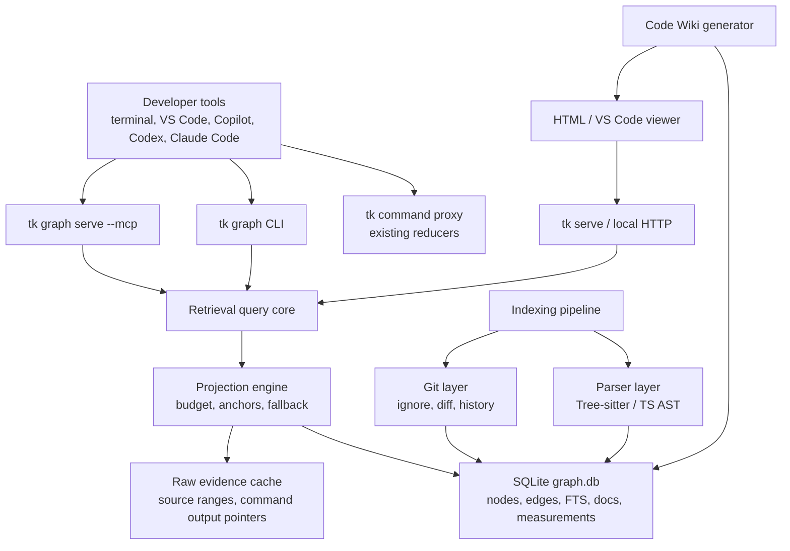

# Token Killer CodeGraph and Code Wiki Next-Stage Architecture

Date: 2026-06-18

Status: research synthesis and implementation plan

Audience: maintainers building Token Killer (`tk`, also called `tg`) as an
enterprise local code-intelligence layer.

This document uses `tk` for the current binary name and `tg` for the broader
product thesis when matching external wording. The implementation plan keeps
the accepted v1 ADR surface intact: graph retrieval is additive, the v1 MCP
surface remains small, and the core command proxy keeps its retention-first
fallback behavior.

## Executive Summary

1. The common winning pattern is not "generate docs". It is a persistent local
   repository knowledge graph with source anchors, freshness metadata, and
   multiple projections: CLI/MCP for agents, HTML/wiki/GUI for humans.
2. `tk` should evolve as an Evidence Projection layer: deterministic graph,
   git, parser, and build evidence first; LLM prose only as optional
   source-cited explanation.
3. The next-stage architecture should have two planes: existing command-output
   reducers for terminal noise, and a repository intelligence plane under
   `src/retrieval/*`.
4. The first implementation target should stay narrow: TypeScript/JavaScript
   file/symbol/import index, SQLite plus FTS5, anchored reads, search, impact
   lite, and measurement hooks.
5. A Code Wiki should be a graph view, not a Markdown dump. Every generated
   block must declare source nodes, line ranges or evidence hashes, freshness,
   and overwrite policy.
6. Human GUI and agent MCP should share the same SQLite graph and query core.
   Do not build separate "docs database" and "agent database" systems.
7. Enterprise adoption favors local CLI, MCP when enabled, VS Code Simple
   Browser or WebView, PowerShell setup, AGENTS/Copilot instruction files, and
   opt-in CI. Avoid intercepting proprietary Copilot traffic.
8. The v1 MCP tool count should remain small. Expose richer query modes through
   `tk_map`, `tk_read`, `tk_search`, and `tk_verify`; only split into many MCP
   tools after measuring schema-token and UX benefits.
9. Default storage should be `node:sqlite` in `~/.token-killer/projects/<repo>/`
   with WAL and FTS5. DuckDB, Neo4j, vector stores, and embeddings are later
   options, not MVP requirements.
10. Do not copy project code blindly. Several useful references have licenses,
    native dependencies, cloud assumptions, LLM-first docs, or MCP surfaces
    that are wrong for a conservative enterprise TypeScript tool.

## Current Repository Constraints

Observed from `README.md`, `docs/DESIGN.md`, and ADRs 0013-0016:

- Core `tk` is a local deterministic command proxy with retention-first raw
  fallback and zero runtime dependencies.
- Current package binary is `tk`; the public product is Token Killer.
- Graph retrieval is already accepted as an additive plane, not a gateway that
  mutates Copilot traffic.
- Current v1 graph install is explicit: `tk install --graph`.
- Current graph storage direction is `node:sqlite` under
  `~/.token-killer/projects/<fingerprint>/graph.db`.
- Current v1 MCP surface is exactly `tk_map`, `tk_read`, `tk_search`,
  `tk_verify`.
- Graph-only code may require Node >= 22.13 while the non-graph CLI can remain
  on the existing lower Node baseline.
- Measurement facts are required, but graph slices must not invent saved-token
  numbers without raw/projected evidence.

Assumption: this report is a next-stage plan. It should not silently replace
accepted v1 scope. The richer `tg_*` tools requested below are treated as a
logical v2 schema and can be folded into the four accepted v1 tools first.

## Merge Notes From `deep-research-report-code-wiki.md`

The deep research report was useful as a broad thesis document, but it was not
safe as the canonical implementation contract because it contained chat-style
source markers, assumed the live repository was unavailable, proposed file
paths that do not match this repo's report style, and did not fully reconcile
its richer MCP surface with ADRs 0013-0016.

This merged report keeps the strongest findings from that draft:

- One persistent repository index should power agent tools, CLI queries, impact
  analysis, wiki pages, and human GUI views.
- The human surface should start as a structural, LLM-free graph explorer and
  source-linked wiki, not as pre-generated LLM prose.
- VS Code should be treated as the viewer and Copilot host. `tk` provides MCP,
  CLI, local HTML, and possibly extension tools; it does not own an LLM or spend
  API tokens.
- Enterprise Copilot integration is policy-gated. MCP and extension tools are
  official integration paths, but org settings may disable them; the local HTML
  viewer and CLI still work without that approval.
- Closed or SaaS references such as DeepWiki and Google Code Wiki are useful
  for interaction patterns, especially outline-first wiki reads and source
  linked prose, but not for local enterprise implementation choices.

## Project-by-Project Matrix

| Project | Category | Best idea to borrow | What to avoid | Relevance | Difficulty | Enterprise fit |
| --- | --- | --- | --- | --- | --- | --- |
| GitNexus | CodeGraph + MCP + Web UI + Wiki | One backend graph with MCP, CLI, HTTP, and web projections | Large tool surface, embeddings/default hooks, noncommercial license risk | Very high | High | Medium-high if simplified |
| Understand Anything | Interactive graph/onboarding UX | Layered graph tours, diff impact, dashboard mental model | LLM summaries as source of truth, plugin-only slash commands | High | Medium | Medium |
| OpenDeepWiki | Server wiki/chat/MCP | Background workers, DB-backed docs, repo-scoped MCP | Cloud/server product complexity, LLM-first generation | Medium-high | High | Medium |
| CodeWiki | Repo docs + HTML | Self-contained HTML docs, include/exclude/focus controls | Prompt-parsed architecture truth, unsafe parsing patterns | Medium | Medium | Medium |
| RepoDoc | Research KG docs | Code/Doc/Concept heterogeneous graph and incremental propagation | Python/LLM API dependency as default | High | Medium-high | Medium |
| ops-codegraph-tool | Function graph + MCP + CI | Diff impact, co-change, CODEOWNERS, CI gates, pagination | 34 MCP tools, native deps, private Claude hacks | Very high | Medium-high | High if narrowed |
| Codebase-Memory MCP | Persistent local KG MCP | No built-in LLM, local persistent KG, routes/IaC/service edges | C rewrite, huge language surface, repo-shared binary DB default | High | High | High conceptually |
| Davia | Editable visual code wiki | Editable generated docs with strict block/schema model | Cloud sync default, docs as standalone truth | Medium-high | Medium | Medium |
| CodeGraph | Pre-indexed MCP graph | Small default MCP surface, `node:sqlite`, stale banner, context builder | Daemon/default repo writes without tk policy review | Very high | Medium | High |
| code-graph-mcp | AST graph MCP | Compression levels, route tracing, Merkle incremental updates | Rust runtime addition, embeddings default | Medium-high | Medium-high | Medium |
| tree-sitter-analyzer | Tree-sitter MCP analyzer | Verdict envelopes, TOON-like compact output, correctness gates | Python/uv requirement, broad flag surface | Medium-high | Medium | Medium |
| Graphify | Multimodal KG | Confidence tags and HTML/report/JSON output triad | Multimodal/API sprawl, repo output defaults | Medium | High | Low-medium |
| GitDiagram | Repo diagram generator | Clickable path validation and diagram validation loop | SaaS/cloud/API-key LLM architecture generation | Low-medium | Low | Low |
| Sourcetrail | Legacy source explorer | Mature offline UX: graph + code + search | GPL/native desktop stack, archived project | Medium | High | Low for code reuse |
| RepoGraph | Research repo graph | Line-level action-space search for agents | Pickle/NetworkX benchmark-only system | Medium | Medium | Low-medium |
| RepoMaster | Research repo understanding | Hierarchical code tree + call graph + module graph for task packs | External web/API agents and repo-discovery scope | Medium | Medium | Low for product |
| RANGER | Graph-enhanced retrieval paper | Deterministic entity queries first, semantic graph walk later | MCTS/embeddings/cross-encoder in MVP | Medium | High | Medium later |
| RIG | Deterministic architecture graph paper | Build/test/config nodes with evidence-backed architecture | CMake-only overfit | High | Medium | High |
| DeepWiki | Closed wiki + MCP reference | Cheap outline-first wiki ladder and declarative page control | Closed/SaaS assumptions and delayed freshness | Medium | Low | Low for implementation |
| Google Code Wiki | Closed code wiki reference | Source-linked prose and commit-aware freshness | Closed preview surface, no local implementation | Medium | Low | Low for implementation |

## Detailed Project Notes

### 1. GitNexus

- Identity: local and web code-intelligence system for agent context, code
  graphs, MCP, web UI, Code Wiki, and enterprise PR blast radius.
- Surface: both agent-facing and human-facing. CLI/MCP/HTTP bridge plus React
  web UI.
- Runtime and persistence: TypeScript/JavaScript monorepo, LadybugDB native for
  CLI/server and WASM for web, Tree-sitter native/WASM, repo registry under the
  user's home directory.
- Capabilities: code graph, symbol/file graph, dependencies, routes/tools/ORM,
  process/community grouping, MCP, web UI, wiki, impact, PR-style blast radius,
  staleness by comparing indexed commit to HEAD.
- Patterns: explicit pipeline DAG, typed phase outputs, single graph
  accumulator, multiple query adapters over one backend, web bridge for browser
  limitations, optional richer graph layers such as PDG.
- Gaps for `tk`: too broad for v1, too many tools, possible license mismatch,
  embedding-heavy paths, and installer behavior that may surprise enterprise
  users.
- Borrow for `tk`: phase DAG, source-stamped graph schema, single query core,
  thin CLI/MCP/HTTP adapters, stale HEAD banner, blast-radius view.
- Avoid for `tk`: copying implementation code, large MCP surface, default
  hooks that alter host tooling, and LLM/embedding assumptions.

### 2. Understand Anything

- Identity: Claude/Codex/Copilot-compatible project understanding plugin with a
  knowledge graph, guided tours, dashboard, chat, explain, diff, and onboarding
  commands.
- Surface: both. Agent commands generate or query graph context; dashboard is
  human-facing.
- Runtime and persistence: TypeScript, local `.understand-anything` JSON graph.
- Capabilities: file/function/class/dependency graph, layered views, guided
  tours, diff analysis, dashboard, generated explanations.
- Patterns: graph JSON interchange, layers for human orientation, tour nodes,
  impact panel around changed files, persona/detail-level outputs.
- Gaps for `tk`: diff impact is often path/edge traversal rather than deep
  semantic proof; summaries can become source of truth if not anchored.
- Borrow: onboarding map, layers, guided tours, dashboard layout, impact panel
  UX.
- Avoid: plugin-only slash-command UX and LLM-authored facts without deterministic
  anchors.

### 3. OpenDeepWiki

- Identity: open-source DeepWiki-like system for importing repositories,
  generating documentation, chatting with docs, exposing MCP, and serving a web
  UI.
- Surface: mostly server/human-facing with MCP agent access.
- Runtime and persistence: .NET backend, Next.js frontend, SQLite/PostgreSQL,
  background workers, LibGit2Sharp, optional Graphify.
- Capabilities: repo import, wiki catalog, generated pages, chat, MCP, mind
  maps, background processing, repo visibility/management.
- Patterns: repository entity model, document files in DB, background tasks,
  repo-scoped MCP endpoint, worker separation from web request path.
- Gaps for `tk`: server product footprint, auth/admin/security burden, cloud
  and LLM API assumptions, more SaaS-like than local tool.
- Borrow: worker/job model, DB-backed doc freshness, repo-scoped API shape.
- Avoid: admin account/auth product scope, LLM-first docs, and requiring model
  keys for baseline value.

### 4. CodeWiki

- Identity: automated repository-level documentation and HTML viewer across
  multiple languages.
- Surface: human-facing docs plus some MCP generation/control tools.
- Runtime and persistence: Python, HTML templates, optional LLM providers or
  subscription mode through existing CLIs.
- Capabilities: hierarchical repository decomposition, module documentation,
  diagrams, include/exclude/focus controls, HTML viewer/export, update mode.
- Patterns: self-contained HTML viewer, module tree, configurable focus areas,
  subscription mode that can reuse the user's existing agent CLI.
- Gaps for `tk`: generated documentation can drift from source, prompt parsing
  is fragile, some implementation choices are unsafe to copy, CDN use is not
  enterprise-safe by default.
- Borrow: static HTML export, include/exclude/focus knobs, module tree.
- Avoid: treating LLM prose as architecture truth and non-local viewer assets.

### 5. RepoDoc

- Identity: research system for repository documentation using a Repository
  Knowledge Graph, module clustering, and incremental documentation updates.
- Surface: mostly human-facing docs, but the graph patterns are agent-relevant.
- Runtime and persistence: Python, graph classes, LLM API configuration,
  generated docs.
- Capabilities: CodeNode/DocNode/ConceptNode graph, module clustering,
  incremental update, impact propagation, token/time measurement.
- Patterns: heterogeneous graph, doc nodes connected to code nodes, semantic
  diff classes, downstream dependency impact, topological regeneration order.
- Gaps for `tk`: LLM/API dependency and Python stack are not acceptable as core
  architecture; repo implementation is less productized than the paper.
- Borrow: DocNode model, freshness/impact propagation, code-to-doc links,
  incremental invalidation.
- Avoid: LLM as required source of repo truth and full Python pipeline.

### 6. ops-codegraph-tool

- Identity: function-level dependency graph, MCP server, CLI, CI gates, and
  architecture analysis tool.
- Surface: agent-facing MCP/CLI plus human HTML plotting and CI outputs.
- Runtime and persistence: Node/TypeScript, Tree-sitter, SQLite, native
  `better-sqlite3`.
- Capabilities: code graph, call graph, diff impact, co-change analysis,
  CODEOWNERS, complexity, communities, architecture boundaries, snapshots,
  HTML viewer, many MCP tools.
- Patterns: CI gates, boundary rules, owner-aware graph, co-change risk,
  paginated MCP outputs, NDJSON/scoped graph rendering.
- Gaps for `tk`: too many tools for MCP, native dependency friction, and
  reverse-engineered Claude-specific MCP optimization hints should not become a
  product contract.
- Borrow: diff impact, CODEOWNERS, co-change, CI gate concepts, pagination.
- Avoid: 34-tool surface and private-client hacks.

### 7. Codebase-Memory MCP

- Identity: persistent local code knowledge graph exposed through MCP to reduce
  repeated code exploration.
- Surface: agent-facing first, optional human UI.
- Runtime and persistence: single static C binary, SQLite, Tree-sitter and
  hybrid LSP, local web UI.
- Capabilities: functions/classes/calls/imports/routes/services/IaC, MCP tools,
  auto-index, watchers, cross-repo, shared compressed graph artifacts.
- Patterns: no built-in LLM, local-only trust posture, broad edge vocabulary,
  compact structural queries instead of file reads.
- Gaps for `tk`: C rewrite and huge language surface are the wrong direction;
  committing binary graph databases can be risky for enterprise repos.
- Borrow: "agent translates, graph verifies" stance, route/service/IaC node
  families, persistent memory model.
- Avoid: language-count arms race and binary artifact sharing by default.

### 8. Davia

- Identity: editable visual internal documentation for coding agents, with
  local docs, whiteboards, Notion-like UI, and optional sync.
- Surface: human-facing first, agent instruction integration second.
- Runtime and persistence: TypeScript monorepo, CLI, web app, `.davia` docs and
  assets, optional cloud workspace.
- Capabilities: generated/editable docs, visual blocks, local server,
  agent-specific instruction files, push/sync.
- Patterns: generated docs as editable block documents, schema-constrained
  content, explicit local docs folder, visual artifact ownership.
- Gaps for `tk`: cloud sync and independent docs truth conflict with local
  deterministic graph-first approach.
- Borrow: manual-edit preservation, block schema, visual page UX.
- Avoid: making docs the source of truth or silently overwriting human edits.

### 9. CodeGraph

- Identity: pre-indexed code knowledge graph and MCP tools optimized for coding
  agents.
- Surface: agent-facing MCP/CLI, with daemon/watch behavior and context packs.
- Runtime and persistence: TypeScript/Node, `node:sqlite`, FTS5, Tree-sitter
  WASM, `.codegraph` data.
- Capabilities: search, node lookup, callers, callees, impact, context builder,
  stale banner, route framework recognition, MCP server.
- Patterns: small default MCP surface, answer-sufficiency context builder,
  freshness signal at connect time, SQLite wrapper with WAL/FTS5.
- Gaps for `tk`: daemon and in-repo storage defaults must be reconciled with
  `tk`'s home-directory storage and explicit install policy.
- Borrow: `node:sqlite`, small MCP surface, context packs, stale banner.
- Avoid: daemon-by-default or repo writes without `tk` policy.

### 10. code-graph-mcp

- Identity: Rust AST graph MCP server with search, call graph, routes, dead
  code, impact, and compression levels.
- Surface: agent-facing.
- Runtime and persistence: Rust, Tree-sitter, SQLite/sqlite-vec, optional local
  embeddings.
- Capabilities: AST knowledge graph, semantic search, recursive graph queries,
  route tracing, Merkle incremental index, context compression levels.
- Patterns: L0-L3 context compression ladder, route-to-handler tracing,
  Merkle-based change detection, compact JSON.
- Gaps for `tk`: Rust runtime is not aligned with current enterprise
  TypeScript constraints; embeddings should not be default.
- Borrow: compression levels and Merkle freshness ideas.
- Avoid: Rust dependency and embedding-first UX.

### 11. tree-sitter-analyzer

- Identity: Python Tree-sitter MCP code intelligence server with facade tools,
  curated skills, and compact output formats.
- Surface: agent-facing.
- Runtime and persistence: Python/uv, Tree-sitter, local analysis.
- Capabilities: cross-file call graph, safety verdicts, compressed output,
  code health, many languages, MCP facade.
- Patterns: verdict envelopes such as SAFE/CAUTION/UNSAFE, compact tabular
  output, cross-language correctness focus, safe-edit gates.
- Gaps for `tk`: Python/uv deployment and very broad option surface are not
  ideal for Windows enterprise rollout.
- Borrow: verdict envelopes and compact output grammar.
- Avoid: making Python a required runtime.

### 12. Graphify

- Identity: converts code, docs, PDFs, office files, images, videos, and more
  into a queryable knowledge graph for agents and humans.
- Surface: both.
- Runtime and persistence: Python package, optional graph DBs and model APIs,
  HTML/report/JSON outputs.
- Capabilities: multimodal graph extraction, many grammars, graph viewer,
  report, MCP optional, confidence tags.
- Patterns: output triad (`graph.html`, report, JSON), confidence labels such
  as extracted/inferred/ambiguous, non-code artifact ingestion.
- Gaps for `tk`: multimodal scope and optional API sprawl are not MVP needs.
- Borrow: confidence tags and future non-code document nodes.
- Avoid: multimodal default and external-model dependency sprawl.

### 13. GitDiagram

- Identity: quick GitHub repository to Mermaid architecture diagram generator.
- Surface: human-facing web/SaaS-like.
- Runtime and persistence: Next.js, FastAPI/backend helpers, cloud storage and
  model APIs.
- Capabilities: repo tree fetch, README analysis, architecture explanation,
  Mermaid diagram, clickable paths, export.
- Patterns: validate generated diagram nodes against real repo paths, retry
  invalid diagrams, clickable source anchors.
- Gaps for `tk`: repo-tree plus README is insufficient for modification
  workflows, and cloud/model assumptions conflict with local-first.
- Borrow: diagram validation and clickable paths.
- Avoid: architecture claims generated from shallow repo fetch.

### 14. Sourcetrail

- Identity: archived offline source explorer with graph, code view, and search.
- Surface: human-facing desktop GUI.
- Runtime and persistence: native C++/Qt stack and SourcetrailDB.
- Capabilities: dependency navigation, source graph, search, offline UI.
- Patterns: mature UX loop: overview graph, focused node graph, code pane,
  cross-reference navigation.
- Gaps for `tk`: GPL/trademark constraints, archived code, heavy native
  dependencies, limited language fit.
- Borrow: UX principles, not code.
- Avoid: native desktop architecture and license contamination.

### 15. RepoGraph

- Identity: research repository-level graph for AI software engineering and
  SWE-bench style agents.
- Surface: agent-facing research integration.
- Runtime and persistence: Python, NetworkX/pickle, JSONL tags.
- Capabilities: line-level graph, definitions/references, search tool,
  benchmark integration.
- Patterns: line-level action-space search and graph-guided repo exploration.
- Gaps for `tk`: not a product architecture; graph output is too noisy and not
  enterprise-operational.
- Borrow: search as initial action-space reducer.
- Avoid: pickle/NetworkX as storage and line-level graph as default output.

### 16. RepoMaster

- Identity: research agent for discovering, understanding, and executing GitHub
  repositories for tasks. The user-provided GitHub URL was inaccessible; the
  available implementation is under `QuantaAlpha/RepoMaster`.
- Surface: agent research system, not local enterprise tool.
- Runtime and persistence: Python, Streamlit, OpenAI/Serper/Jina style APIs.
- Capabilities: hierarchical code tree, function call graph, module dependency
  graph, multi-agent execution, web dashboard.
- Patterns: combine tree, module graph, and function graph before choosing
  task context.
- Gaps for `tk`: external web/API dependencies and repo-discovery scope are
  outside local token-control.
- Borrow: hierarchical context-pack construction.
- Avoid: web-search agents and external API requirements.

### 17. RANGER

- Identity: graph-enhanced repository retrieval research for code-entity and
  natural-language queries.
- Surface: agent-facing retrieval.
- Runtime and persistence: paper architecture with KG, Cypher, embeddings,
  MCTS-style traversal.
- Capabilities: variable-level graph, entity queries, NL query traversal,
  graph-guided retrieval.
- Patterns: deterministic entity queries first, semantic/NL traversal second.
- Gaps for `tk`: MCTS, embeddings, and cross-encoders are too heavy for MVP.
- Borrow: dual query path and graph traversal for ambiguous natural-language
  requests later.
- Avoid: ML retrieval as v1 dependency.

### 18. RIG

- Identity: deterministic Repository Intelligence Graph for buildable
  components, tests, packages, and architecture evidence.
- Surface: agent-facing architecture evidence, also useful for humans.
- Runtime and persistence: research prototype, CMake/CTest SPADE extractor.
- Capabilities: component graph, build/test graph, package manager artifacts,
  evidence-backed architecture queries.
- Patterns: build/test/config nodes are first-class, not prose; architecture
  answers cite deterministic build artifacts.
- Gaps for `tk`: avoid CMake-only overfit and implement TS/JS build artifacts
  first.
- Borrow: BuildTarget/Test/Script/Config nodes and evidence-backed repo map.
- Avoid: making v1 graph depend on build-system integration.

### 19. DeepWiki and Google Code Wiki

- Identity: closed or SaaS-like code wiki references, not implementation
  sources for `tk`.
- Surface: human-facing wiki plus agent query/chat patterns.
- Patterns: cheap outline-first ladder before full page reads, declarative page
  control, source-linked prose, and freshness tied to repository changes.
- Gaps for `tk`: not local-first, not implementation-copyable, and not a
  reliable model for enterprise-restricted Windows machines.
- Borrow: `map -> page outline -> focused content -> source anchor` as both
  wiki and MCP interaction grammar.
- Avoid: hidden regeneration, closed hosting, and claims the local graph cannot
  independently verify.

## Unified Pattern

Successful projects converge on this architecture:

1. Build a persistent local graph from deterministic evidence.
2. Attach every graph node and edge to source anchors, hashes, confidence, and
   provenance.
3. Use cheap structural queries before raw file reads.
4. Expose the same query core through CLI, MCP, local HTTP, and GUI/wiki.
5. Keep outputs token-budgeted and progressive: map -> focused node -> bounded
   source slice -> raw fallback.
6. Update incrementally from git/file hashes instead of regenerating everything.
7. Generate docs as graph projections, not as independent LLM-authored truth.
8. Keep human edits separate from generated blocks.
9. Treat impact analysis as graph traversal over changed files/symbols,
   imports, callers, tests, routes, config, and co-change evidence.
10. Make staleness visible rather than pretending the index is always fresh.

## Unified Architecture



### Component Responsibilities

- Parser layer: extracts files, symbols, imports, exports, calls, classes,
  routes, tests, configs, scripts, and source ranges.
- Git layer: applies ignore rules, detects dirty/staged/committed changes,
  computes changed files, and later co-change edges.
- Symbol index: stable symbol IDs, qualified names, kind, signature, line range,
  doc comments, export/import status.
- File index: normalized path, language, size, hash, mtime, token estimate,
  generated/vendor/noise flags.
- Dependency graph: imports, exports, references, package dependencies.
- Call graph: best-effort static calls with confidence and unresolved targets.
- Search index: SQLite FTS5 over paths, symbols, comments, signatures, and
  selected headings; BM25 first.
- Wiki generator: emits graph-grounded pages and stale/manual block metadata.
- Impact engine: graph traversal from files/symbols/diffs to callers, tests,
  routes, configs, owners, and co-change evidence.
- Projection engine: token budget, rank, compact output, source anchors, raw
  fallback pointer.
- MCP server: small schema, read-only tools, progressive disclosure.
- VS Code/HTML layer: local views over the same query API.
- Enterprise policy layer: no-network, redaction, allowed roots, ignored paths,
  max file size, storage location, audit logs.

## Graph Model

### Node Types

| Type | Deterministic source | MVP |
| --- | --- | --- |
| Repository | git root | yes |
| Package | package.json, lockfiles, pyproject, pom, etc. | partial |
| Module | directory/package boundary heuristic | yes |
| Directory | file system inventory | yes |
| File | file system inventory | yes |
| Symbol | parser/AST | yes for TS/JS |
| Function | parser/AST | yes |
| Class | parser/AST | yes |
| Interface | parser/AST | yes for TS |
| Type | parser/AST | yes for TS |
| Route | framework-specific parser rules | later |
| Endpoint | route plus handler | later |
| Test | filename and test framework AST | later |
| Config | package.json, tsconfig, vitest, CI files | partial |
| Script | package.json scripts, shell scripts | partial |
| BuildTarget | package scripts, build configs | later |
| Dependency | lockfile/package manifest | partial |
| WikiPage | wiki metadata | phase 3 |
| ChangeSet | git diff/status | phase 2 |

### Edge Types

| Edge | Deterministic? | Notes |
| --- | --- | --- |
| contains | yes | repository -> directory -> file -> symbol |
| imports | yes mostly | unresolved imports carry `confidence=low` |
| exports | yes | from AST/package exports |
| calls | partial | static calls deterministic when target resolves |
| implements | yes | TS/Java style declarations |
| extends | yes | class/interface inheritance |
| references | partial | symbol references from AST/grep fallback |
| configures | yes mostly | config file to script/build/test target |
| tests | heuristic | test name/import proximity, later framework-specific |
| routes_to | heuristic | framework-specific route mapping |
| builds | yes mostly | scripts/config to output/build target |
| owns | heuristic | CODEOWNERS/package ownership |
| documents | yes | wiki block/page to graph node |
| changed_by | yes | git diff/status to nodes/files |
| impacts | derived | traversal result, not stored as fact unless cached |
| co_changes_with | heuristic | git history statistics |

LLM assistance may draft Concept or Wiki explanations, but it must not create
unverified structural edges. LLM-derived claims require citations and
`source=llm_draft`.

## Storage Model

Recommended MVP stack:

- SQLite via `node:sqlite` for all persistent graph, file, symbol, FTS, wiki,
  and measurement metadata.
- WAL mode and bounded transactions for indexing.
- FTS5 virtual tables for path/symbol/comment/signature search.
- File-system cache for raw slices, generated HTML, and raw command output
  pointers.
- JSONL for measurement events and audit logs where append-only behavior is
  useful.

Do not use in MVP:

- Neo4j-like graph DB: too heavy for local Windows enterprise rollout.
- DuckDB: useful for analytics, not needed for operational graph queries.
- LanceDB/vector stores: optional later; embeddings raise policy, storage, and
  model questions.
- In-memory graph only: fast but loses persistence and staleness guarantees.

Suggested tables:

```sql
files(id, repo_id, path, language, size_bytes, content_hash, mtime_ms,
      token_estimate, is_generated, is_vendor, indexed_at)
nodes(id, repo_id, kind, name, qualified_name, file_id, start_line, end_line,
      signature, content_hash, confidence, provenance_json)
edges(id, repo_id, kind, from_node_id, to_node_id, file_id, confidence,
      provenance_json, created_at)
symbols_fts(node_id, name, qualified_name, signature, path, comments)
wiki_pages(id, repo_id, slug, title, path, generated_at, stale_state,
           manual_policy, metadata_json)
wiki_blocks(id, page_id, block_id, block_kind, source_node_id, source_hash,
            generated_hash, manual_hash, stale_state, content)
changesets(id, repo_id, base_ref, head_ref, status, metadata_json)
measurements(id, repo_id, operation, raw_tokens, projected_tokens,
             fallback_reason, metadata_json, created_at)
```

## Query Model

### CLI Surface

MVP commands should fit existing ADR naming first:

```bash
tk graph doctor
tk graph index [--changed] [--force] [--watch]
tk graph map [--scope src/auth] [--budget 1500]
tk graph search "auth login" [--kind symbol|text|path] [--budget 1000]
tk graph read src/auth/session.ts [--symbol createSession] [--budget 1500]
tk graph verify --diff [--budget 2000]
tk graph serve --mcp
```

Next-stage aliases can expose the product thesis:

```bash
tg index
tg search "auth login"
tg symbol createSession
tg callers createSession
tg callees createSession
tg impact src/auth/session.ts
tg impact --diff
tg read src/auth/session.ts --budget 1500
tg context "change login expiration logic" --budget 4000
tg wiki build
tg wiki stale
tg serve
tg mcp
```

### MCP Surface

V1 should keep four accepted tools. The richer logical tools map onto them:

| Logical v2 tool | V1 adapter |
| --- | --- |
| `tg_repo_map`, `tg_stale_docs`, `tg_stats` | `tk_map` |
| `tg_read`, `tg_symbol`, `tg_callers`, `tg_callees`, `tg_wiki_page` | `tk_read` or `tk_search` with mode |
| `tg_search` | `tk_search` |
| `tg_impact`, `tg_context_pack` | `tk_verify` or `tk_read` with context mode |

#### `tg_search`

Input:

```json
{
  "query": "auth login",
  "scope": "src/",
  "kind": "text|symbol|path|mixed",
  "limit": 20,
  "budget": 1000
}
```

Output:

```json
{
  "status": "ok|stale|fallback",
  "budget": {"requested": 1000, "used_estimate": 720},
  "results": [
    {
      "node_id": "node:src/auth/session.ts:createSession",
      "kind": "function",
      "path": "src/auth/session.ts",
      "range": [12, 54],
      "score": 0.91,
      "why": "symbol name and imports match query"
    }
  ],
  "raw_fallback": null,
  "diagnostics": []
}
```

Use instead of grep when the agent is looking for a concept, symbol, route, or
entry point. Fall back to raw grep guidance if the index is missing/stale and
the user did not allow indexing.

#### `tg_read`

Input:

```json
{
  "target": "src/auth/session.ts",
  "symbol": "createSession",
  "range": null,
  "budget": 1500,
  "mode": "outline|focused|full_if_small"
}
```

Output includes imports, selected symbol body or signature, nearby referenced
symbols, omitted ranges, anchors, and raw file pointer. If the file is small or
projection is risky, return raw content.

#### `tg_symbol`

Input: `{"name":"createSession","scope":"src/","budget":800}`

Output: canonical symbol record, overloads/candidates, defining file/range,
signature, export status, callers/callees counts, confidence.

#### `tg_callers` and `tg_callees`

Input: `{"symbol":"createSession","depth":2,"limit":30,"budget":1200}`

Output: compact adjacency list with file/range anchors, confidence, unresolved
calls, and recommendation for the next `tg_read`.

#### `tg_impact`

Input:

```json
{
  "target": "src/auth/session.ts",
  "diff": false,
  "base": "HEAD",
  "depth": 2,
  "include": ["callers", "tests", "routes", "configs"],
  "budget": 2000
}
```

Output: changed symbols/files, impacted callers, impacted tests/routes/configs,
risk flags, source evidence, and raw diff pointer. If graph confidence is low,
return "impact uncertain" with raw diff and suggested commands.

#### `tg_context_pack`

Input: `{"task":"change login expiration logic","budget":4000,"scope":"src/"}`

Output: ordered context pack: repo/module map, target symbols, focused reads,
impact/test hints, omitted candidates, and fallback suggestions. This replaces
multiple rounds of `rg`, `find`, and full-file reads.

#### `tg_wiki_page`

Input: `{"page":"auth-flow","budget":2000,"include_sources":true}`

Output: rendered wiki blocks, source anchors, stale/manual status, and related
graph nodes.

#### `tg_repo_map`, `tg_stale_docs`, `tg_stats`

These return high-level map, stale wiki/index diagnostics, and raw/projected
measurement facts. They should be compact by default and include pagination.

## Code Wiki Design

The Code Wiki is a view over the graph. Default output should live in
`~/.token-killer/projects/<fingerprint>/wiki/` and rendered HTML cache. Writing
wiki files into the repository should require an explicit flag such as
`tk wiki export --project docs/tk-wiki`.

### Page Rules

- Every page references graph nodes or source files.
- Every generated claim has source anchors or is marked as `inferred`.
- Every generated block has freshness metadata.
- Human-curated blocks are never overwritten silently.
- Generated and manual content are separated at the block level.
- HTML rendering must work without CDN access.

### File Format

Use Markdown plus typed directives. It remains diff-friendly and readable by
humans, but machines can re-render and invalidate blocks.

```md
---
tk_wiki_version: 1
page_id: wiki:authentication-flow
title: Authentication Flow
owns:
  - node:src/auth/session.ts:createSession
  - file:src/auth/session.ts
generated_at: 2026-06-18T00:00:00.000Z
freshness:
  src/auth/session.ts: sha256:abc123
manual_policy: preserve
---

# Authentication Flow

::source{file="src/auth/session.ts" symbol="createSession" lines="12-54"}

::generated{id="overview" source="graph" budget=600}
This section is regenerated only when its source hashes change.
::endgenerated

::impact{symbol="createSession" show="callers,tests,routes" depth=2 budget=800}

::diagram{type="callgraph" root="createSession" depth=2 format="mermaid"}

::manual{id="notes"}
Human-owned notes live here and are preserved across regeneration.
::endmanual
```

Directive grammar:

- `::source{file, symbol?, lines?, node?}`: source anchor.
- `::generated{id, source=graph|llm_draft, budget, stale?}`: machine block.
- `::manual{id}`: human block.
- `::impact{file?|symbol?, show, depth, budget}`: embedded impact query.
- `::diagram{type, root, depth, format}`: generated graph view.
- `::include{page|node}`: composition.

## GUI and HTML Design

MVP should be static HTML export plus optional local server:

- Static export: `tk graph map --html` or `tk wiki build --html`.
- Local server: minimal Node HTTP or Hono-like internal server only if adding a
  dependency is approved; otherwise use built-in `node:http`.
- VS Code: open the local URL in Simple Browser first. A WebView extension is
  v2 after the API and policy stabilize.
- Graph renderer: prefer vendored Cytoscape.js or Sigma.js for interactive
  graph exploration; use Mermaid only for small deterministic detail diagrams.

Required views:

- Repo map: modules, entry points, dependency hot spots.
- Architecture graph: packages/modules/scripts/configs/build targets.
- File/module explorer: path tree plus symbol outline.
- Symbol page: definition, signature, callers, callees, tests, docs.
- Impact panel: target -> callers/tests/routes/configs/co-change.
- Diff impact view: changed symbols and risk flags.
- Wiki page view: generated/manual blocks with freshness.
- Evidence panel: all claims link to source ranges.
- Search view: query, ranked results, next reads.
- Staleness view: changed files, stale nodes, stale wiki pages.
- Token savings dashboard: raw/projected/fallback measurement events.

The human surface should report navigation facts, not invented token savings:
nodes shown, total nodes, expansion depth, stale nodes, anchors opened, and raw
source links followed. Token savings belong to the agent-facing projection
surface where raw and projected outputs can be measured.

## Enterprise VS Code and Copilot Integration

| Path | Feasibility | Security risk | Enterprise fit | Maintenance | Token reduction | Notes |
| --- | --- | --- | --- | --- | --- | --- |
| CLI wrapper | High | Low | High | Low | High for terminal noise | Already `tk` core path |
| MCP server | Medium-high | Low-medium | Medium-high if enabled | Medium | High for exploration | Additive, no traffic interception |
| VS Code extension | Medium | Medium | Medium | High | Medium-high | v2 after API stabilizes |
| Copilot/AGENTS instructions | High | Low | High | Low | Medium | Teaches agent to prefer `tk graph` |
| PowerShell aliases/functions | High | Low | High | Medium | High for Windows | Must handle quoting and PATH |
| Local HTTP server | High | Low-medium | High if localhost only | Medium | Human-facing | No source leaves machine |
| VS Code Simple Browser | High | Low | High | Low | Human-facing | Good first GUI path |
| Git hooks | Medium | Low-medium | Medium | Medium | Medium | Opt-in only |
| CI integration | Medium | Low-medium | Medium-high | Medium | Medium | Impact reports, policy gates |
| CDP/Electron automation | Low | High | Low | High | Uncertain | Do not rely on proprietary internals |
| Copilot traffic interception | Not proven | High | Low | High | High if possible | Non-goal unless vendor-supported |

Officially supported VS Code/Copilot paths include MCP tools, extension tools,
custom agents, chat participants, instruction files, and prompt/context
customization. Those are the durable integration points for `tk`. Anything that
requires observing or rewriting proprietary Copilot traffic is out of scope
unless the vendor publishes a supported API.

## Token Reduction Mechanics

| Feature | Replaces | Projected output | Expected reduction | Risk | Fallback |
| --- | --- | --- | --- | --- | --- |
| Structured search | Raw `rg` pages | Grouped symbols/files, counts, anchors, next reads | 50-85% | Missing text hit | Raw grep guidance or raw result pointer |
| Directory map | `Get-ChildItem -Recurse` noise | Collapsed tree, generated/vendor elision, entry points | 60-95% | Hidden important file | Show omissions and raw command pointer |
| Symbol read | Full file read | Imports, target symbol, relevant neighbors | 60-95% | Lost context around side effects | Raw file if low confidence or small file |
| Diff impact | Full diff pasted to agent | Changed symbols, risky hunks, impacted callers/tests | 70-95% | Misclassified impact | Raw diff pointer and uncertainty flags |
| Context pack | Repeated grep/read loops | Ordered map/search/read/impact bundle | 40-90% | Wrong task interpretation | Expose candidates and ask for narrower target |
| Wiki page | Onboarding prompt with file tree | Source-linked module/page summary | 60-90% | Stale docs | Staleness banner and source anchors |
| Call graph | Manual caller/callee grep | Compact adjacency list | 50-90% | Dynamic calls unresolved | Mark unresolved and suggest search |
| Stats dashboard | Manual token accounting | Raw/projected event facts | N/A | Misleading savings | Store only measured comparisons |

Retention-first rule: if projected output is empty, longer than raw, missing
critical anchors, or has low confidence for the requested operation, return raw
or provide an explicit raw recovery pointer.

## Implementation Roadmap

### Phase 0: Audit Current `tk`

- User value: prevent architecture drift from current accepted design.
- Scope: inspect CLI handlers, filters, tests, package layout, graph ADRs, and
  existing reports.
- Commands: `git status --short --branch -uall`, `rg --files`, `pnpm test`.
- Schema changes: none.
- Tests: none unless code changes.
- Risks: confusing next-stage v2 design with current v1 acceptance criteria.
- Exit criteria: documented plan aligned with README, DESIGN, and ADRs.

### Phase 1: Repository Index MVP

- User value: fast local map/search/read without repeated file dumps.
- Scope: file index, gitignore support, language detection, TS/JS symbol
  extraction, imports/exports, SQLite persistence, changed-file indexing.
- Commands: `tk graph doctor`, `tk graph index`, `tk graph map`.
- Schema changes: `files`, `nodes`, `edges`, `symbols_fts`, `measurements`.
- Tests: file inventory fixtures, gitignore fixtures, TS/JS symbol fixtures,
  SQLite migration tests, stale index tests.
- Risks: parser dependency size, Node version gate, Windows path handling.
- Exit criteria: index a medium TS repo, map symbols, reindex changed files,
  and never affect non-graph `tk` commands.

### Phase 2: Agent Context Tools

- User value: fewer grep/read loops and safer bounded context for agents.
- Scope: `search`, `read --budget`, `impact --file`, `context`, v1 MCP
  adapter, measurement facts, Copilot instruction examples.
- Commands: `tk graph search`, `tk graph read`, `tk graph verify --diff`,
  `tk graph serve --mcp`.
- Schema changes: add query measurement rows and optional impact cache.
- Tests: budget truncation, raw fallback, stale warnings, MCP JSON-RPC, Windows
  path quoting.
- Risks: over-summarizing source, large MCP schemas, stale index trust.
- Exit criteria: agent can locate, read, and plan a small edit with fewer raw
  tokens than grep/read while preserving raw recovery.

### Phase 3: Code Wiki MVP

- User value: project onboarding and architecture understanding from the same
  graph used by agents.
- Scope: project overview, module pages, source citations, freshness metadata,
  static HTML export, manual block preservation.
- Commands: `tk wiki build`, `tk wiki stale`, `tk wiki export --html`.
- Schema changes: `wiki_pages`, `wiki_blocks`, `doc_sources`.
- Tests: generated/manual block merge, stale invalidation, HTML snapshot, no
  CDN references.
- Risks: docs becoming stale or hallucinated, accidental overwrite of human
  edits.
- Exit criteria: changed source marks affected pages stale, manual blocks
  survive regeneration, every generated claim has source metadata.

### Phase 4: GUI and VS Code

- User value: human impact inspection before editing.
- Scope: `tk serve`, repo map, symbol page, impact panel, search, staleness,
  token dashboard, VS Code Simple Browser workflow.
- Commands: `tk serve`, `tk graph map --html`, `tk wiki open`.
- Schema changes: none required beyond phase 3; add cached view metadata if
  useful.
- Tests: browser smoke, no external network requests, large graph pagination,
  mobile/basic accessibility if UI grows.
- Risks: frontend dependency bloat and graph rendering performance.
- Exit criteria: local viewer opens from VS Code, graph is nonblank, search and
  impact links resolve to source anchors.

### Phase 5: Enterprise Hardening

- User value: safe rollout in restricted Windows/VS Code environments.
- Scope: policy config, no-network mode, redaction, audit logs, large-repo
  performance, PowerShell polish, CI integration, docs.
- Commands: `tk graph doctor --enterprise`, `tk policy check`,
  `tk ci impact --diff`.
- Schema changes: policy and audit event tables if JSONL is insufficient.
- Tests: no-network test, redaction fixtures, performance benchmarks, CI
  fixtures, PowerShell install/uninstall.
- Risks: policy complexity and support matrix growth.
- Exit criteria: documented enterprise install, no-network pass, predictable
  storage, measurable query latency on large repos.

## First 10 Engineering Tasks

1. Land this next-stage design report without touching current source changes.
2. Add `src/retrieval/types.ts` with stable request/response, source anchor,
   budget, confidence, and fallback types.
3. Add graph doctor skeleton that checks Node version, `node:sqlite`, repo root,
   storage path, and no-network policy.
4. Add SQLite schema and migration tests for `files`, `nodes`, `edges`,
   `symbols_fts`, and `measurements`.
5. Implement file inventory with gitignore/noise filtering and Windows path
   normalization.
6. Implement TS/JS symbol extraction fixtures for functions, classes,
   interfaces, exports, and imports.
7. Implement `tk graph map --json` using only file/symbol/import evidence.
8. Implement `tk graph read` with budgeted symbol/file slices and raw fallback.
9. Implement `tk graph search` over path/symbol/signature FTS with ranked
   anchors.
10. Add measurement tests that compare raw token estimate, projected estimate,
    fallback reason, and source-anchor coverage.

## Risks and Non-Goals

- Do not intercept proprietary Copilot traffic.
- Do not make LLM-generated architecture the source of truth.
- Do not add cloud services, model API keys, or embeddings to the MVP.
- Do not expose a 20- or 30-tool MCP surface before measuring schema overhead.
- Do not write graph/wiki artifacts into the repository by default.
- Do not rewrite the product in Rust, Go, C, or Python for v1.
- Do not chase language-count claims before TS/JS quality is proven.
- Do not treat stale wiki pages as valid context without warnings.

## Files to Create or Modify

Created:

- `docs/reports/codegraph-codewiki-next-stage-20260618.md`

Recommended later:

- `src/retrieval/types.ts`
- `src/retrieval/storage/schema.sql`
- `src/retrieval/storage/sqlite.ts`
- `src/retrieval/indexer/fileInventory.ts`
- `src/retrieval/indexer/tsSymbols.ts`
- `src/retrieval/query/search.ts`
- `src/retrieval/query/read.ts`
- `src/retrieval/query/impact.ts`
- `src/retrieval/mcp/server.ts`
- `tests/unit/retrieval/*`
- `tests/fixtures/retrieval/*`

## Source Set

- GitNexus: https://github.com/abhigyanpatwari/GitNexus
- Understand Anything: https://github.com/Lum1104/Understand-Anything
- OpenDeepWiki: https://github.com/AIDotNet/OpenDeepWiki
- CodeWiki: https://github.com/FSoft-AI4Code/CodeWiki
- RepoDoc: https://github.com/SYSUSELab/RepoDoc and https://arxiv.org/abs/2604.26523
- ops-codegraph-tool: https://github.com/optave/ops-codegraph-tool
- Codebase-Memory MCP: https://github.com/DeusData/codebase-memory-mcp and https://arxiv.org/abs/2603.27277
- Davia: https://github.com/davialabs/davia
- CodeGraph: https://github.com/colbymchenry/codegraph
- code-graph-mcp: https://github.com/sdsrss/code-graph-mcp
- tree-sitter-analyzer: https://pypi.org/project/tree-sitter-analyzer/
- Graphify: https://github.com/safishamsi/graphify
- GitDiagram: https://github.com/ahmedkhaleel2004/gitdiagram
- Sourcetrail: https://github.com/CoatiSoftware/Sourcetrail
- RepoGraph: https://github.com/ozyyshr/RepoGraph
- RepoMaster paper: https://arxiv.org/abs/2505.21577
- RANGER paper: https://arxiv.org/abs/2509.25257
- Repository Intelligence Graph paper: https://arxiv.org/abs/2601.10112
- VS Code tools with agents: https://code.visualstudio.com/docs/copilot/agents/agent-tools
- VS Code MCP developer guide: https://code.visualstudio.com/api/extension-guides/ai/mcp
- VS Code custom agents: https://code.visualstudio.com/docs/agent-customization/custom-agents
- VS Code Language Model Tool API: https://code.visualstudio.com/api/extension-guides/ai/tools
- VS Code custom instructions GA note: https://code.visualstudio.com/updates/v1_98
- GitHub Copilot MCP overview: https://docs.github.com/en/copilot/concepts/context/mcp
