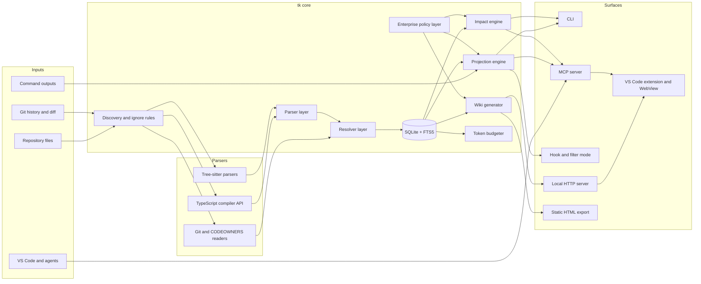

# Next-Stage Architecture for tk

## Executive Summary

- The strongest common pattern across the best repository-intelligence projects is **one persistent repository index, many surfaces**: the same local graph powers agent tools, terminal queries, impact analysis, and human-facing views. GitNexus wires one graph into CLI, MCP, and a web client; OpenDeepWiki reuses indexed repository content for docs, chat, embeds, and MCP; CodeGraph exposes one SQLite-backed index through CLI, MCP, and an embeddable library; Understand Anything saves a project graph that drives its dashboard and follow-on commands. citeturn13view0turn12view0turn22view2turn15view0

- The thesis is correct: **`tk` should evolve from a reducer into a local evidence layer**. The next product is not “better compression.” It is a deterministic repository map that can answer structural questions cheaply, then project only the minimum evidence needed into the agent context. That matches the direction of GitNexus, CodeGraph, code-graph-mcp, ops-codegraph-tool, and Codebase-Memory, all of which exist to replace repeated grep/read loops with pre-indexed structural queries. citeturn19view5turn22view5turn24view7turn12view4turn33view0

- The best architecture for `tk` is **TypeScript-first, local-first, SQLite-first, deterministic-first**: TypeScript compiler APIs plus Tree-sitter for parsing, SQLite + FTS5 for persistence and search, git metadata for change awareness, and MCP/CLI/HTML/VS Code surfaces on top. This is the most practical fit for enterprise Windows environments compared with projects that depend on custom graph databases, runtime cloud services, or heavyweight server stacks. GitNexus uses LadybugDB and native grammar builds; OpenDeepWiki depends on a server stack plus LLM configuration; CodeWiki is documentation-centric and LLM-heavy; Davia is editable and local, but its documentation substrate is HTML/MDX rather than a code-truth graph. citeturn19view0turn12view1turn20view1turn21search0

- `tk` should treat **deterministic evidence as the source of truth** and use LLMs only for organization and explanation. RepoDoc explicitly uses a repository knowledge graph as the semantic backbone for generation and updates; RIG argues for a deterministic build-and-test-derived architectural map; RepoGraph and RepoMaster both reduce token pressure by retrieving graph-selected context rather than whole files; RANGER routes structural queries to graph lookups and uses heavier semantic exploration only when direct symbolic retrieval fails. citeturn16view0turn32view1turn30view1turn31search1turn32view0

- The Code Wiki should not be a Markdown dump. The better model is **graph-grounded, stale-aware, source-linked, incrementally regenerable documentation**. RepoDoc stores documentation as graph entities and selectively regenerates affected parts; OpenDeepWiki publishes repository docs while reusing the same indexed content for chat and MCP; Davia shows that editable local documentation matters; GitDiagram and CodeWiki show the value of validated diagrams and architecture-oriented output. citeturn16view0turn12view0turn21search0turn28view4turn20view3

- For enterprise VS Code and GitHub Copilot, the realistic, supportable integration paths are **CLI wrappers, MCP, custom instructions, hooks, custom agents, and extensions**. VS Code officially supports MCP servers, custom instructions, custom agents, hooks, and chat participants. There is no published basis for directly intercepting proprietary Copilot traffic, so `tk` should treat that as a non-goal. citeturn36search1turn36search0turn37search1turn37search0turn36search2turn37search9

- Impact analysis should be promoted from “nice extra” to **core workflow primitive**. GitNexus includes impact, change detection, route mapping, and API-impact tools; ops-codegraph-tool includes diff impact, co-change analysis, and CI gates; code-graph-mcp includes impact analysis and route tracing; CodeGraph provides callers, callees, impact, and affected tests; RIG contributes an important missing layer: build/test/component topology, which most AST-only systems under-model. citeturn19view5turn17view3turn24view1turn22view2turn32view1

- The token-reduction target is realistic if `tk` stops treating every interaction as raw terminal text. Published systems in adjacent spaces report substantial savings: code-graph-mcp reports 5–20× less token use per understanding task and 40–60% full-session savings; Codebase-Memory reports ten times fewer tokens than file-by-file exploration at competitive quality; RepoDoc reports 85% fewer tokens for documentation generation and 77% fewer for updates; RepoMaster reports 95% lower token use on its benchmark; Graphify publishes 71.5× lower query cost on one mixed corpus example. `tk` should use these as directional evidence, not as guaranteed product claims. citeturn24view7turn33view0turn16view0turn31search1turn35view1

- I could not inspect the live `tk` repository itself in this session because no repository checkout, upload, or repository URL was available. The design below is therefore grounded in the project context you provided plus direct research on the reference projects, not in a line-by-line audit of the current `tk` codebase.

## Project-by-Project Analysis

| Project | Category | Best idea to borrow | What to avoid | Relevance to `tk` | Implementation difficulty | Enterprise fit |
|---|---|---|---|---|---|---|
| GitNexus | Local code graph + MCP + web UI | One graph shared by CLI, MCP, HTTP bridge, and browser UI; stale-index detection; route, impact, diff, and rename tools. citeturn13view0turn19view0turn19view5 | LadybugDB dependency, native grammar build complexity, and broad global config mutation during setup. citeturn19view0turn19view3 | Very high | High | Medium |
| Understand Anything | Human-first interactive graph + dashboard | Domain view, guided tours, diff impact, incremental graph refresh, and graph-as-artifact for onboarding. citeturn15view0turn15view1 | Heavy multi-agent generation as the main truth layer; brittle plugin auto-discovery assumptions. citeturn15view0 | High | Medium | Medium |
| OpenDeepWiki | Server-based docs/chat/MCP platform | Same indexed repository content reused for docs, chat, MCP, and background refresh; repository-scoped MCP endpoints. citeturn12view0turn12view2 | Large server stack, admin surface, and LLM/service dependencies that are heavier than `tk` needs. citeturn12view1 | Medium-high | High | Medium-low |
| CodeWiki | Repo-level documentation generator | Hierarchical decomposition, module trees, HTML viewer output, diagram validation, token controls. citeturn20view1turn20view3 | LLM-heavy recursive generation as the center of the architecture rather than a view over deterministic evidence. citeturn20view1turn8view3 | High for wiki | Medium-high | Medium-low |
| RepoDoc | Repo knowledge graph + incremental docs | RepoKG as semantic backbone; module clustering; semantic impact propagation; selective regeneration. citeturn16view0 | Paper-stage complexity and concept extraction that may be too ambitious for `tk` MVP. citeturn16view0 | Very high | High | High if simplified |
| ops-codegraph-tool | Local CLI/MCP/CI code intelligence | SQLite + Tree-sitter; watch mode; diff impact; co-change; CI gates; architecture boundaries. citeturn12view4turn17view3turn17view6 | Very broad 34-tool surface for an early `tk`; more than `tk` should ship in one phase. citeturn17view2 | Very high | Medium-high | High |
| Codebase-Memory MCP | High-performance local graph MCP | Single-binary mindset; persistent graph; hybrid syntactic + semantic resolution; route/test/community nodes; strong supply-chain posture. citeturn18view2turn18view8turn33view0 | Pursuing extreme language breadth and custom embedded semantic engines too early. citeturn18view8turn33view0 | Very high | Very high | High |
| Davia | Editable local code wiki | Manual-edit preservation, local file-backed docs, whiteboard-style explainers, browser workspace over local files. citeturn13view7turn21search0 | Treating documentation files as primary truth rather than graph-grounded projections. citeturn21search0turn21search1 | Medium-high | Medium | High |
| CodeGraph | Pre-indexed local graph for agents | Zero-config per-project local graph; auto-sync; small canonical MCP tool set; strong tool guidance. citeturn22view1turn13view6 | Anonymous telemetry by default in some flows; broad language ambition before enterprise tailoring. citeturn23view0 | Very high | Medium | High |
| code-graph-mcp | Compact AST graph MCP | SQLite + FTS5 + sqlite-vec; Merkle incremental detection; route tracing; token-aware compression. citeturn24view0turn24view5 | Rust/C/Candle stack for a TS-first product; vector search as a default requirement. citeturn24view0turn24view5 | High | Medium | High |
| tree-sitter-analyzer | Agent-native Python MCP + CLI | TOON compressed output, verdict envelopes, edit-safety gates, curated skills. citeturn25view0 | Huge CLI/tool surface and Python/uv dependency chain for a TypeScript-first Windows product. citeturn25view0 | High | Medium-high | Medium |
| Graphify | Multi-modal knowledge graph + skill | Graph JSON + HTML + report trio; query-first assistant guidance; mixed corpus handling. citeturn27view0turn27view2turn35view1 | Sending non-code artifacts to model APIs by default and mixing many modalities too early. citeturn27view3turn26view4 | Medium | Medium | Medium |
| GitDiagram | Architecture diagram generator | File-tree-grounded graph generation, path validation, clickable Mermaid nodes. citeturn28view4turn28view2 | Cloud storage and hosted generation architecture; diagram-only view without local repo intelligence depth. citeturn28view4 | Medium | Low-medium | Medium-low |
| Sourcetrail | Legacy interactive source explorer | Excellent human navigation model: offline, local, clickable source exploration. citeturn29view0turn29view3 | Archived codebase, limited language model, GPL constraints, no agent-native workflow. citeturn29view3 | Medium | Low | Medium-low |
| RepoGraph | Graph retrieval plug-in for coding agents | Line-level def/ref graph and subgraph retrieval for repo-aware localization. citeturn30view0turn30view1 | Research prototype shape; cached benchmark focus rather than live local engineering ergonomics. citeturn30view0 | Medium-high | Medium | Medium |
| RepoMaster | Repo understanding for autonomous reuse | Function-call graph + module dependency graph + hierarchical code tree to shrink context. citeturn31search1 | Solving open GitHub task execution is broader than `tk`; depends on repo search/reuse loops `tk` does not need. citeturn31search1 | Medium | High | Medium-low |
| RANGER | Query-type-aware graph retrieval | Two-path retrieval: symbolic queries via graph, natural language via heavier exploratory path. citeturn32view0 | MCTS and reranking latency for everyday local developer workflows. citeturn32view0 | Medium-high | High | Medium |
| RIG | Deterministic build/test architecture graph | Build/test/component/test-target graph as a missing evidence layer above AST-level parsing. citeturn32view1 | Treating build/test topology as sufficient by itself; it must complement file/symbol graphs, not replace them. citeturn32view1 | Very high | Medium | Very high |

### Highest-priority projects

**GitNexus** solves “give the agent the graph before it starts exploring” with a shared index across CLI, MCP, and browser UI. Architecturally, it is one of the clearest confirmations of the user thesis: its monorepo has an ingestion pipeline, persistent graph storage, three query surfaces, and staleness detection; it also ships practical workflow tools such as impact analysis, diff mapping, route mapping, rename previews, and group-aware multi-repo querying. The main downside for `tk` is operational: LadybugDB, tree-sitter prebuild complexity, and aggressive `setup` behavior are harder to normalize across locked-down Windows enterprise machines than SQLite plus a smaller MCP surface. `tk` should directly copy the **one-index-many-surfaces** pattern, stale-index hints, and route/impact/detect-changes tooling, but avoid the bespoke graph database dependency and broad installer mutation as an MVP choice. citeturn13view0turn19view0turn19view3turn19view5

**Understand Anything** is the clearest human-facing counterweight to agent-first graph tools. It stores a graph artifact in `.understand-anything/knowledge-graph.json`, drives a dashboard from it, supports domain/business-flow views, guided tours, fuzzy/semantic search, diff impact, and incremental updates, and is explicitly pitched as a way to teach developers the codebase rather than only expose a hairball graph. That makes it highly relevant to `tk wiki` and `tk serve`: `tk` should borrow the concept of **progressive explanation views**—repo structure, domain grouping, guided tours, onboarding packs—while keeping the graph itself deterministic and local. The parts to avoid are using a multi-agent generation pipeline as the main engine of truth and assuming IDE/plugin discovery behavior that may not be stable across enterprise environments. citeturn15view0turn15view1

**OpenDeepWiki** is a strong example of how one repository index can feed human docs, chat, embeds, and MCP. It ingests Git URLs, ZIPs, and local directories; publishes repository pages; exposes repository-scoped MCP endpoints; and runs background workers for processing, translations, mind maps, Graphify artifacts, and incremental updates. For `tk`, the key lesson is not to copy the whole platform. The useful pattern is **shared indexing plus repository-scoped serving**. The weak fit is its breadth: admin console, auth, messaging channels, Docker deployment, and LLM provider configuration are beyond what a local enterprise-side tool needs. `tk` should imitate the reuse of one backing index across docs and agent tools, but keep the deployment model local-first and avoid the SaaS/platform center of gravity. citeturn12view0turn12view1turn12view2

**CodeWiki** is the strongest documentation-focused system in the list. Its key ideas are hierarchical decomposition, recursive agentic processing, and multi-modal synthesis into overview pages, module docs, JSON module trees, visuals, and optional HTML. It also exposes explicit token controls and max-depth controls, which matters because it treats repository documentation as a scaling problem, not a single prompt. `tk` should borrow the **hierarchical assembly discipline**—repo overview first, then modules, then leaves—and the HTML export pattern. It should not copy CodeWiki’s LLM-heavy center of gravity for its evidence layer. In `tk`, the hierarchy should be graph-driven first; LLM explanation should be a downstream page-generation step. citeturn20view1turn20view3turn20view4turn8view3

**RepoDoc** is the most important conceptual blueprint for `tk wiki`. Its paper argues that the repository knowledge graph should be the semantic backbone for the whole documentation lifecycle, with module clustering, graph-driven retrieval for generation, semantic impact propagation, and selective regeneration. It also models documentation as entities linked back to code and reports large reductions in token use and update cost. For `tk`, this is the right mental model: wiki pages are not prose files first; they are **views over graph nodes with freshness and invalidation semantics**. `tk` should simplify the design for production by making concept extraction optional, clustering heuristic where possible, and regeneration block-scoped rather than page-global. citeturn16view0

**ops-codegraph-tool** is the most implementation-ready local engineering template for `tk`. It combines Tree-sitter parsing, SQLite storage, incremental build/watch flows, function-level dependency graphs, diff impact, co-change analysis, CI gates, and a large MCP tool surface. The best things to borrow are the practical workflow pieces: incremental rebuild boundaries, watch mode, diff-impact from git refs, co-change as a supplement to static dependency analysis, and architecture policy enforcement. The thing not to copy directly is the size of the public surface. `tk` does not need 34 tools initially; it needs a small, disciplined set with strong defaults. citeturn12view4turn12view3turn17view3turn17view4turn17view6

**Codebase-Memory MCP** shows what a graph-native system looks like when aggressively optimized for agent workflows: persistent knowledge graph, sub-millisecond queries, route and community entities, a single-binary distribution model, hybrid syntactic/semantic resolution, file watcher sync, and a strong security/release story. It is relevant not because `tk` should reimplement its C engine, but because it validates three design decisions: **persistent graph over repeated reads**, **small typed MCP tools**, and **security-conscious local distribution**. What `tk` should reinterpret here is the two-layer resolver model: Tree-sitter is useful, but for TypeScript/JavaScript, the TypeScript compiler and project service should supply semantic resolution before any optional embedding or LLM layer. citeturn18view2turn18view5turn18view8turn33view0

**Davia** is less about graph intelligence and more about editable documentation ergonomics. Its `.davia` project structure, local file storage, browser workspace, HTML pages, MDX components, JSON data, and notion-like editing make one critical point: generated docs that humans cannot safely edit get abandoned. `tk` should borrow the **manual/generated separation** and the idea that the local viewer should read real project files, not an opaque database dump. It should avoid Davia’s temptation to make the documentation substrate itself the primary product; for `tk`, docs remain a surface over evidence. citeturn13view7turn21search0turn21search1

### Secondary references

**CodeGraph** is a particularly valuable reference because it is close to `tk`’s likely shape: local, SQLite-backed, zero-config per project, auto-syncing, embeddable, and centered on a small tool vocabulary—search, explore, callers, callees, impact, node, files, status. Its strongest idea is not just the graph; it is the **tool guidance** delivered to the agent, telling the model when not to fall back to grep/read loops because the index already exists. `tk` should adopt that behavior explicitly in MCP tool descriptions and custom instructions. The parts to avoid are telemetry-sensitive defaults in privacy-conscious enterprise settings and a wider language scope than the product immediately needs. citeturn22view1turn22view2turn22view5turn13view6turn23view0

**code-graph-mcp** is the cleanest “small but sharp” MCP-oriented code graph. It uses SQLite, FTS5, sqlite-vec, BLAKE3/Merkle incremental detection, recursive CTEs for traversal, route tracing, and token-aware compression. Its performance table is especially useful because it maps single graph tools directly onto the multi-call grep/read workflows they replace. `tk` should adapt that mapping mentality and its storage pragmatism, but likely defer vector search and keeping the stack purely Rust-native. citeturn24view0turn24view1turn24view5turn24view7

**tree-sitter-analyzer** contributes two ideas worth stealing even though the overall project is too broad: **compressed response formats** and **safety envelopes**. Its TOON output and verdict envelopes show how an MCP tool can return structured, compact, decision-oriented output instead of generic JSON blobs. Its edit-safety workflows also point toward a future `tk` capability: “Is this safe to change?” should be answerable before an agent opens five files. `tk` should copy the response discipline, not the sprawling CLI surface or Python/uv packaging model. citeturn25view0

**Graphify** is the strongest reference for multi-modal graph packaging. It produces an HTML graph, a Markdown report, and a persistent graph JSON from one run, and it pushes assistants toward `graphify query` rather than repeated file reads. It also proves that a graph can be useful even when the corpus includes documents and diagrams, not only code. For `tk`, the important reinterpretation is smaller: ship **graph JSON + human HTML + concise report** from one index build, but keep code as the privileged source of truth and make non-code ingestion optional. citeturn27view0turn27view2turn35view1

**GitDiagram** matters because it solves a very common human problem fast: “show me the architecture.” Its two-pass generation, path validation, Mermaid validation, and clickable nodes are exactly the right biases for `tk wiki` diagrams. `tk` should not replicate GitDiagram’s hosted-service architecture or model-heavy generation; it should borrow the diagram validation loop and file-backed click-through behavior for static exports. citeturn28view4turn28view2

**Sourcetrail** is old, archived, and not agent-native, but its UX instinct remains excellent: offline, local, cross-platform, clickable source exploration is still the right human baseline. For `tk`, Sourcetrail is a reminder that a repo map must support **fast manual navigation** even if no LLM is involved. Its archived state, GPL licensing, and limited language support make it reference material, not a model to copy directly. citeturn29view0turn29view3

**RepoGraph** is useful because it focuses on line-level def/ref relations and subgraph retrieval for coding tasks. That is a strong reminder that “repo graph” does not have to mean only file/module summaries; a graph can localize the exact evidence span needed for the next step. For `tk`, that means `tk read` should be able to produce line-range-grounded evidence packs, not just file-level summaries. citeturn30view0turn30view1

**RepoMaster** is broader than `tk`, but one of its design lessons is directly relevant: it uses function-call graphs, module-dependency graphs, and hierarchical code trees to identify core components and only then expands outward, which is exactly how a token-budgeted context pack should behave. `tk` should borrow the **progressive exploration and pruning strategy**, not the full autonomous repo-search-and-reuse task scope. The paper is the primary verified source here; I did not independently verify the implementation repository state beyond what the paper cites and public search results surfaced. citeturn31search1turn31search4

**RANGER** matters because it articulates a useful separation that most tools blur: code-entity queries and natural-language queries are not the same problem. It routes symbolic queries to graph lookups and falls back to a heavier exploratory algorithm only for natural-language cases. `tk` should adopt the same product rule in simpler form: prefer deterministic symbol/file/route/test graph queries first; bring in fuzzy or semantic ranking only when exact lookup is insufficient. citeturn32view0

**RIG** contributes the missing build/test layer that most AST-driven tools ignore. Its deterministic architectural map is derived from build and test artifacts rather than source syntax, emphasizing which components exist, how they build, which tests exercise them, and what external packages they use. `tk` should not replace its code graph with RIG’s abstraction, but it should absolutely add a **build/test evidence layer** so `tk impact` can answer “which tests and build targets are implicated?” rather than only “which callers exist?” citeturn32view1

## Unified Architecture

The optimal architecture for `tk` is a **local repository evidence plane** with four layers:

1. **Acquisition layer**: file discovery, `.gitignore` handling, git metadata, terminal/output interceptors, and language-specific parsers.
2. **Evidence layer**: persistent local store containing file inventory, symbols, edges, text index, and change metadata.
3. **Query/projection layer**: budgeted search/read/context/impact APIs that always return evidence with traceable provenance.
4. **Surface layer**: CLI commands, MCP tools, VS Code integration, static wiki export, and local GUI.

This is the shared pattern that the better tools converge on even when their packaging differs: GitNexus uses one backing graph for CLI, MCP, and web; OpenDeepWiki uses one repository index for docs, chat, and MCP; CodeGraph uses one SQLite-backed graph for MCP, CLI, and code; RepoDoc uses one RepoKG for generation and updates; RIG argues for an evidence-backed architectural map instead of ad hoc exploration. citeturn13view0turn12view0turn22view2turn16view0turn32view1



The internal modules should be explicit packages or top-level folders, not an undifferentiated CLI codebase:

- `core/discovery`: ignore rules, file inventory, language detection, path normalization, symlink handling, `.gitignore`, enterprise exclusions.
- `core/parser-ts`: TypeScript/JavaScript extraction using the TypeScript compiler API and project service.
- `core/parser-treesitter`: secondary language extractors where TypeScript semantics are unavailable or too costly.
- `core/git`: status, diff, log, hunks, blame-lite metadata, co-change tables, branch base selection.
- `core/graph`: node/edge model, graph writes, traversals, transitive closures, route/test/build projections.
- `core/search`: symbol search, file search, FTS, rank fusion, optional embeddings plugin.
- `core/projector`: command-output reducers, search projection, read projection, diff projection, context-pack assembly.
- `core/impact`: changed-symbol detection, caller/callee walks, route/test/build impact, risk scoring.
- `core/wiki`: page graph, block invalidation, HTML export, stale detection, manual block merge.
- `core/mcp`: schemas, tool adapters, tool guidance text, budget enforcement, fallback envelopes.
- `core/policy`: privacy mode, redaction, allowlists/denylists, no-network mode, logging policy.
- `ui/server` and `ui/web`: local Hono server plus React/Vite viewer, later reused in VS Code WebView.

### Graph model

`tk` should use a **property graph on top of SQLite tables**, not a separate graph database in the MVP.

**Node types**

- `Repository`
- `Package`
- `Module`
- `Directory`
- `File`
- `Symbol`
- `Function`
- `Method`
- `Class`
- `Interface`
- `Type`
- `Enum`
- `Route`
- `Endpoint`
- `Test`
- `Config`
- `Script`
- `BuildTarget`
- `Dependency`
- `WikiPage`
- `ChangeSet`
- `Community`
- `Owner`

**Edge types**

- `CONTAINS`
- `IMPORTS`
- `EXPORTS`
- `CALLS`
- `IMPLEMENTS`
- `EXTENDS`
- `REFERENCES`
- `CONFIGURES`
- `TESTS`
- `ROUTES_TO`
- `BUILDS`
- `OWNS`
- `DOCUMENTS`
- `CHANGED_BY`
- `IMPACTS`
- `CO_CHANGES_WITH`
- `USES_DEPENDENCY`
- `AFFECTS_BUILD`
- `AFFECTS_TEST`
- `MEMBER_OF`

**Deterministic edges first**

`CONTAINS`, `IMPORTS`, `EXPORTS`, `IMPLEMENTS`, `EXTENDS`, most `CALLS` in TypeScript, `CONFIGURES`, `CHANGED_BY`, and many `TESTS` edges can be derived deterministically from the repository, parser, framework conventions, or git history. This matches the strongest practice in RepoDoc, Codebase-Memory, code-graph-mcp, and RIG: structural evidence is extracted once and queried many times. citeturn16view0turn33view0turn24view5turn32view1

**Heuristic edges second**

`IMPACTS` is computed, not stored as truth; `CO_CHANGES_WITH` comes from git-history statistics; `OWNS` can come from `CODEOWNERS`, directory conventions, or recent author concentration; some `ROUTES_TO` or `TESTS` edges will depend on framework conventions and naming heuristics; some `CALLS` for unsupported languages will be “best effort.”

**LLM-assisted edges last**

Business-domain concepts, architecture labels, human-readable module names, glossary terms, and wiki explanations can be generated as overlays, but they must be attached to deterministic nodes and invalidated when dependencies change. That is where `tk` should take inspiration from Understand Anything’s domain view and RepoDoc’s concept/doc entities, without elevating LLM output to primary truth. citeturn15view0turn16view0

### Storage model

For `tk`, the most practical MVP storage stack is:

- **SQLite** in `.tk/index.db` for nodes, edges, metadata, and migrations.
- **FTS5** in SQLite for symbol/file/content search.
- **JSONL caches** in `.tk/cache/` for parsed-file snapshots, reducer baselines, and wiki block invalidation state.
- **Filesystem artifacts** in `.tk/wiki/` and `.tk/html/` for generated pages and exports.
- **Optional vector plugin later**, not in the MVP.

That choice is better than alternatives for this product:

- **SQLite** is portable, local, robust, and already validated by CodeGraph, code-graph-mcp, ops-codegraph-tool, and Codebase-Memory. It also fits Windows and restricted enterprise laptops far better than a separate graph server. citeturn22view2turn24view0turn12view4turn18view2
- **DuckDB** is attractive for analytical tables, but weaker as the primary OLTP-style project graph and FTS-backed operational store.
- **Neo4j-like graph DBs** are overkill and operationally hostile for the stated deployment constraints.
- **In-memory-only graphs** fail staleness, reuse, and startup-time goals.
- **LanceDB/local vectors** are worth adding only when `tk` already has strong deterministic symbol/file retrieval and a clear offline embedding story.

A further pragmatic recommendation: ship two runtime modes.

- **Dev mode**: run under Node 22+ with a normal npm install.
- **Enterprise release mode**: bundle a self-contained Node runtime so SQLite behavior, path handling, and PowerShell integration are stable across machines. CodeGraph’s bundled-runtime approach and Codebase-Memory’s single-binary mindset are both worth emulating at the packaging level even though `tk` stays TypeScript-first internally. citeturn23view0turn18view2

## Proposed Feature Set

### Token reduction core

The current reducer idea should expand into a **projection engine** with domain-specific reducers and retention-first fallbacks.

Core features:

- CLI output reducers for `git`, `rg`, `grep`, `Get-ChildItem`, `Get-Content`, `Select-String`, `npm`, `pnpm`, `yarn`, `cargo`, `pytest`, `vitest`, `jest`, `dotnet test`, and common build tools.
- Suspicion/fallback gates: empty output, longer-than-raw, ambiguous truncation, unresolved errors, low confidence, or unsafe omission.
- Token accounting for raw vs projected output, per command and per session.
- “Evidence refs” in every projected output: file paths, symbols, counts, line ranges, omitted-count metadata.
- Deterministic projection modes before any summarization. If a reducer can only “explain” but cannot preserve the needed facts, `tk` should return the raw output.

This is the natural extension of the grep/read replacement evidence shown by CodeGraph, code-graph-mcp, and Codebase-Memory. citeturn22view5turn24view7turn33view0

### CodeGraph

The first graph scope should be intentionally narrow and strong:

- TypeScript/JavaScript first with semantic resolution via TypeScript project APIs.
- File inventory, package/module/file/symbol graph.
- Imports/exports/callers/callees/reference edges.
- Route extraction for Express, Next.js route handlers, NestJS, and selected PowerShell scripts if present.
- Test discovery and test-to-source linking.
- Build/config extraction from `package.json`, tsconfig variants, workspace files, and common CI/build files.
- Git-aware changed-symbol mapping.

Language expansion should follow real demand and use cases, not star-chasing. Codebase-Memory and CodeGraph prove that breadth is useful, but `tk` should win on **TypeScript depth plus enterprise ergonomics** first. citeturn18view8turn23view0

### Code Wiki

`tk wiki` should generate:

- Project overview page
- Architecture page
- Package/module pages
- Route/API pages
- Data model pages
- Build/deploy pages
- Testing pages
- Ownership pages when inferable
- Diff impact pages for pending or recent changes
- Mermaid diagrams, validated before publish
- Static HTML export and local viewer

The defining rule is that every page is a **graph-backed page with freshness metadata**, not just generated prose. That is the durable part of RepoDoc, OpenDeepWiki, Davia, and GitDiagram. citeturn16view0turn12view0turn21search0turn28view4

### Impact analysis

`tk impact` should become a first-class feature family:

- `tk impact <file|symbol>` for transitive source impact
- `tk impact --diff` for current working tree or staged diff
- `tk impact --routes` for route-level implications
- `tk impact --tests` for likely affected tests
- `tk impact --build` for build-target/config/package effects
- `tk impact --history` for historical co-change enrichment
- `tk impact --why` for evidence-backed explanation of each edge in the impact chain

This is where RIG’s build/test layer should be fused with the AST/symbol graph patterns from GitNexus, ops-codegraph-tool, CodeGraph, and code-graph-mcp. citeturn32view1turn19view5turn17view3turn22view2turn24view1

### GUI and HTML

The MVP human surface should be:

- Static HTML export from wiki pages and summary JSON
- Local `tk serve` for interactive graph and evidence panels
- React/Vite UI eventually reused in a VS Code WebView
- React Flow for interactive maps in the served UI
- Mermaid for exportable diagrams in HTML/wiki pages
- Evidence side-panel showing exact source ranges and graph edges
- Search panel, staleness panel, diff impact panel, token dashboard

GitNexus, Understand Anything, Graphify, GitDiagram, and Davia all validate the importance of a browsable human surface; the difference for `tk` is that the GUI must remain a **view over a local evidence index**, not a separate product. citeturn13view0turn15view0turn27view0turn28view4turn21search0

### VS Code and Copilot integration

The supportable integration stack for `tk` is:

- MCP server for Copilot/VS Code and other MCP-capable agents
- instruction files: `AGENTS.md`, `.github/copilot-instructions.md`
- optional `.agent.md` or project-scoped custom-agent files
- official VS Code hooks where available
- optional VS Code extension with chat participant and WebView
- PowerShell aliases/functions and terminal wrappers for enterprise command use

This aligns with official VS Code/Copilot customization paths: MCP servers, custom instructions, custom agents, hooks, and chat participants are all supported customization mechanisms. citeturn36search1turn36search0turn37search1turn37search0turn36search2turn37search3

### Enterprise hardening

`tk` should ship with:

- `privacyMode`, `noNetwork`, and `redactSecrets` settings
- explicit policy file for excluded paths and blocked commands
- no-telemetry default for enterprise builds
- local audit log for reducer decisions and wiki invalidations
- deterministic replay fixtures for reducer correctness
- Windows path, PowerShell, UTF-16/UTF-8, and console-width handling
- watchdog for stale indexes and corrupted caches
- portable `.tk/` repo-local state plus opt-in global registry

## CLI and MCP Spec

The CLI should remain concise. The mistake many projects make is exposing the full internal graph vocabulary before user workflows are clear. `tk` should expose **workflow commands**, not graph internals first.

### CLI commands

| Command | Purpose | Output shape | Budget behavior | Safety fallback |
|---|---|---|---|---|
| `tk index [path]` | Build or refresh repo evidence index | status summary, counts, timings, stale reasons | N/A | full rebuild if schema/version mismatch |
| `tk search "auth login"` | Symbol/file/content search | ranked grouped hits with evidence refs | `--budget` limits returned snippets and groups | if low confidence, append raw grep hints |
| `tk symbol createSession` | Symbol definition lookup | canonical match + signature + file + refs | default small payload; expand with `--full` | multiple matches return disambiguation set |
| `tk callers createSession` | Upstream usage | grouped call sites, counts, top evidence | depth/limit controlled | unresolved links clearly marked |
| `tk callees createSession` | Downstream usage | grouped callees with edge evidence | depth/limit controlled | partial graph returns “best effort” flag |
| `tk impact src/auth/session.ts` | Static impact analysis | files, symbols, tests, routes, build hints, risk | trims by risk rank and requested facets | if evidence weak, fall back to changed-symbol-only |
| `tk impact --diff` | Working-tree/staged diff impact | changed files, changed symbols, blast radius | budget favors changed symbols first | fallback to raw `git diff --stat` + hunk list |
| `tk read src/auth/session.ts --budget 1500` | Budgeted file or symbol read | symbol-centered extracts + surrounding context + omissions | hard token ceiling with progressive degradation | raw range read if extraction too uncertain |
| `tk context "change login expiration logic" --budget 4000` | Task-oriented context pack | repo map, candidate symbols, impact, tests, targeted snippets | allocates budget across sections | if pack confidence low, include exploration suggestions |
| `tk wiki build` | Build or refresh wiki pages | page counts, stale counts, output paths | `--budget` applies to generated explain blocks only | skip explain block if insufficient evidence |
| `tk wiki stale` | Show invalid docs/blocks | stale pages/blocks with reasons | compact by default | N/A |
| `tk serve` | Run local API/UI | local URL and health summary | N/A | readonly mode if db lock detected |
| `tk mcp` | Start stdio MCP server | MCP server | per-tool budgets enforced | if repo unindexed, report inactive tools |
| `tk hook <cmd…>` | Wrap projected terminal command | projected stdout + stats | inherits reducer budget policy | raw passthrough on suspicion |
| `tk stats` | Session and command savings | tables and deltas | N/A | N/A |
| `tk doctor` | Diagnose install/index/integration issues | checks + fix suggestions | N/A | N/A |

### MCP tools

Each tool should accept a **`budget_tokens`** field and return a **`confidence`** plus **`fallback_used`** flag.

| Tool | Input schema | Output schema | When to use | Fallback behavior |
|---|---|---|---|---|
| `tk_search` | `{ query, kind?, path_scope?, budget_tokens?, limit? }` | `{ hits:[{kind,name,path,line_range,score,evidence}], omitted, confidence }` | Find names, concepts, or likely modules before reading files | If ranking is weak, include a raw text-search appendix |
| `tk_read` | `{ target, target_kind:file|symbol|route, budget_tokens, mode?:focused|surrounding|full }` | `{ extracts:[...], omitted_ranges:[...], warnings:[...], confidence }` | Read only the evidence needed for reasoning or editing | Return raw range if projection is unsafe |
| `tk_symbol` | `{ name, path_scope?, include_refs? }` | `{ matches:[{id,kind,signature,path,line_range,exports,refs?}] }` | Resolve a symbol exactly | Return disambiguation set when ambiguous |
| `tk_callers` | `{ symbol, depth?, include_tests?, budget_tokens? }` | `{ root, callers:[...], summary, confidence }` | Ask “who depends on this?” | Mark unresolved edges; never invent |
| `tk_callees` | `{ symbol, depth?, include_external? , budget_tokens? }` | `{ root, callees:[...], summary, confidence }` | Ask “what does this invoke?” | Same as above |
| `tk_impact` | `{ target, target_kind?, diff_mode?:working|staged|ref, include?:["symbols","files","tests","routes","build"], budget_tokens? }` | `{ changed:[...], impacts:{symbols,files,tests,routes,build}, risk, evidence, confidence }` | Before modifying code or reviewing a diff | Fall back to file-level and git-level evidence if symbol mapping is incomplete |
| `tk_context_pack` | `{ task, budget_tokens, scope?, include_history? }` | `{ repo_map, likely_targets, impact, tests, snippets, next_actions, confidence }` | Replace ad hoc grep/read loops for task setup | Return “insufficient confidence” with recommended follow-up tools |
| `tk_wiki_page` | `{ page_id, mode?:rendered|source|evidence, budget_tokens? }` | `{ page, stale, blocks, evidence_refs }` | Reuse wiki pages inside agent sessions | If stale, prepend warning and stale reasons |
| `tk_repo_map` | `{ scope?, depth?, include?:["packages","modules","routes","tests","build"], budget_tokens? }` | `{ overview, modules, hot_spots, entrypoints, evidence }` | Onboarding and planning | If index partial, label missing dimensions |
| `tk_stale_docs` | `{ scope? }` | `{ stale_pages:[...], stale_blocks:[...], reasons:[...] }` | Pre-edit doc maintenance and UI alerts | N/A |
| `tk_stats` | `{ period?:session|day|repo }` | `{ token_saved, raw_tokens, projected_tokens, fallback_rate, top_commands }` | Ops/reporting and user feedback | N/A |

### Examples

```json
{
  "tool": "tk_search",
  "input": {
    "query": "login expiration",
    "kind": "mixed",
    "path_scope": "src/",
    "budget_tokens": 900,
    "limit": 8
  }
}
```

```json
{
  "tool": "tk_impact",
  "input": {
    "target": "src/auth/session.ts",
    "target_kind": "file",
    "include": ["symbols", "tests", "routes", "build"],
    "budget_tokens": 1400
  }
}
```

```json
{
  "tool": "tk_context_pack",
  "input": {
    "task": "change login expiration logic",
    "budget_tokens": 4000
  }
}
```

Agents should use these tools **instead of raw grep/read** when the question is structural, impact-oriented, or context-planning-oriented. They should still use raw file reads for final editing, exact string search for literals, and shell tools when the index does not cover the needed language or artifact type. That division is consistent with code-graph-mcp’s own benchmark claims and “traditional tools are still better for exact string search and final file reading” guidance. citeturn24view7

## Code Wiki Format

The Code Wiki should be a **block-based, graph-grounded document format** that is:

- more structured than Markdown
- simpler than HTML
- readable in plain text and diffs
- renderable to static HTML
- safe for manual editing
- invalidatable block by block

Davia proves that editable local docs matter; RepoDoc shows why docs should be linked back to graph entities; OpenDeepWiki and CodeWiki show the value of publishable views and hierarchy. The missing piece is a format that separates human edits from generated evidence blocks. citeturn21search0turn16view0turn12view0turn20view1

### Recommended format

Use `*.tkw.md` files with YAML frontmatter and **typed blocks**.

```md
---
page_id: wiki/authentication-flow
title: Authentication Flow
kind: module
anchors:
  - module:src/auth
  - symbol:createSession
freshness:
  repo_head: 8d3a4a1
  generated_at: 2026-06-18T09:30:00Z
owner: generated
---

# Authentication Flow

:::generated
id: overview
depends_on:
  - symbol:createSession
  - file:src/auth/session.ts
mode: deterministic+explain
budget_tokens: 700
:::
@source file="src/auth/session.ts" symbol="createSession"
@read symbol="createSession" lines="40-118"
@impact target="symbol:createSession" show="callers,tests,routes" depth="2"
@diagram type="callgraph" root="symbol:createSession" depth="2"
@explain source="graph"
:::

:::manual
id: maintainer-notes
owner_hint: team-auth
:::
Session expiration must remain aligned with policy values in `src/config/auth.ts`.
:::

:::generated
id: related-files
depends_on:
  - module:src/auth
mode: deterministic
:::
@list kind="files" scope="src/auth" limit="20"
:::
```

### Block semantics

- `:::generated ... :::` blocks are tool-owned and can be rebuilt.
- `:::manual ... :::` blocks are human-owned and must never be overwritten silently.
- `depends_on` references graph nodes or files.
- `mode` controls whether a block is pure deterministic projection or deterministic plus explanation.
- `@source`, `@read`, `@impact`, `@diagram`, `@list`, `@search`, `@repo_map`, and `@explain` are declarative directives that the renderer resolves.
- Every rendered claim should carry a hidden or visible evidence payload: file path, symbol ID, line ranges, graph node IDs, generation time, source hashes.

### Staleness model

Each generated block stores:

- source node IDs
- source file hashes or mtime/commit fingerprints
- graph schema version
- generation timestamp
- renderer version
- optional model/version if explanation was used

A block becomes stale if any dependency hash changes, if the graph schema changes, or if the generator version invalidates its rendering contract.

### HTML/GUI design

The human-facing viewer should ship in two tiers.

**MVP**

- `tk wiki build --html` generates static HTML into `.tk/html/`
- Mermaid diagrams rendered to SVG in the export
- no database requirement at viewing time
- source citations clickable to file/line views
- architecture map is mostly page-driven, not full-force graph canvas

**Interactive local mode**

- `tk serve` starts a local Hono API backed by SQLite
- React/Vite UI with:
  - repo map
  - architecture graph
  - file/module explorer
  - symbol page
  - impact panel
  - diff impact view
  - wiki page view
  - evidence panel
  - search view
  - staleness view
  - token savings dashboard

This combines the practical strengths of GitNexus’ HTTP bridge, Understand Anything’s dashboard, Graphify’s HTML artifact, GitDiagram’s clickable diagrams, and Davia’s local browser workspace, while still staying TypeScript-first. citeturn19view6turn15view0turn27view0turn28view4turn21search0

## Token Reduction Mechanics

The strategic mistake in most coding-agent sessions is not “the model is too verbose.” It is that the model is repeatedly shown the **wrong substrate**: raw command output, full files, repeated search results, and re-derived structure. The systems that report real token gains all move from raw text exploration to **graph-backed, query-shaped evidence**. code-graph-mcp measures fewer tool calls and 40–60% session savings; Codebase-Memory reports a tenfold token reduction against file-based exploration; RepoDoc reports 85% fewer tokens for documentation generation and 77% fewer for updates; RepoMaster reports 95% lower token use on its benchmark; Graphify publishes a 71.5× lower query-cost example on a mixed corpus. citeturn24view7turn33view0turn16view0turn31search1turn35view1

| Feature | Current waste | Projected replacement | Expected reduction | Main risk | Fallback | How to measure |
|---|---|---|---|---|---|---|
| `git status` reducer | repeated path lists, untracked noise, unchanged branch boilerplate | grouped file counts by state, renamed/deleted highlights, top risky paths | 70–95% | hiding a rare but important path | raw passthrough when counts and listed paths disagree | compare raw/projected token count and missed-path rate |
| `git diff` projector | full hunks into context for simple planning | changed symbols, affected files, risky hunks, tests/routes/build impact | 60–90% | semantic summary omits exact edit | attach hunk anchors for high-risk files; raw on parser mismatch | compare issue-resolution accuracy and edit reversions |
| `rg` / `grep` projector | dozens of line hits with no structure | grouped hits by symbol/file, de-duplicated snippets, confidence-ranked next actions | 70–95% | loss of exact literal context | include literal appendix for low-confidence queries | measure first-tool success rate and follow-up reads |
| `Get-ChildItem` / directory listing | huge folder noise | skeletal tree + hidden-noise count + key config/build dirs | 80–98% | missing an unusual generated-but-important folder | raw if folder count is small or exclusions uncertain | compare navigation latency and correction rate |
| raw file read | full files for small edits | symbol-aware extract, relevant imports/exports, nearest tests/routes | 40–85% | missing side-condition elsewhere in file | allow `--full` or auto-append raw ranges on ambiguous symbols | compare edit success and subsequent read frequency |
| repeated onboarding exploration | agent re-reads structure every session | repo map + wiki overview + module pages | 80–98% | stale architecture guidance | stale warning + quick refresh path | measure tokens to answer standard onboarding prompts |
| modification planning | grep → read → grep loop | `tk context_pack` with likely targets, callers, tests, configs, routes | 60–95% | pack picks wrong locus | emit confidence and “what is not included” section | compare patch localization accuracy |
| docs generation/update | whole-repo prompts or full module regeneration | stale-block regeneration from graph diffs | 50–90% | stale detection misses an indirect dependency | conservative invalidation on uncertain edges | compare page-update cost and stale-block recall |

The operating rule should be simple:

- If the question is **structural**, answer from the graph.
- If the question is **exact/textual**, answer from exact search.
- If the task is **editing**, use the graph to choose what to read, then read the exact evidence.
- If confidence falls below threshold, **return more evidence, not more prose**.

## Implementation Roadmap

Because the live repository was not available in this session, the roadmap below includes a Phase 0 audit that should be done against the actual `tk` codebase before refactoring. The rest is designed so an engineer can begin implementation immediately.

### Phase 0

**User value**

- Establish what already exists, what abstractions are missing, and how much of the reducer framework can be retained.

**Technical scope**

- Inspect current package structure, command registry, reducer interfaces, stats/tracing, test coverage, config handling, and any existing CodeGraph experiments.
- Identify whether current reducers are command-string-based, AST-aware, or post-hoc string filters.
- Inventory Windows/PowerShell assumptions.

**Exact commands**

- `pnpm test`
- `pnpm lint`
- `tk --help`
- `tk stats --help`
- `tk hook --help`

**Schema changes**

- None yet.

**Tests required**

- Snapshot the current reducer outputs and fallback behavior before any graph changes.

**Risks**

- Hidden coupling between CLI reducer code and terminal-wrapper behavior.

**Exit criteria**

- Architecture audit document written.
- Current extension points mapped.
- Existing quality gates cataloged.

### Phase 1

**User value**

- One local repository index. Fast symbol and file lookup. No UI yet required.

**Technical scope**

- File discovery and ignore rules
- TypeScript/JavaScript symbol extraction
- SQLite schema and migrations
- FTS5 search
- Incremental file hashing
- `tk index`, `tk search`, `tk symbol`, `tk read`

**Exact commands**

- `tk index`
- `tk search "auth login"`
- `tk symbol createSession`
- `tk read src/auth/session.ts --budget 1200`

**Schema changes**

- Initial tables: `files`, `symbols`, `edges`, `search_docs`, `file_hashes`, `schema_meta`

**Tests required**

- ignore-rule compliance
- Windows path normalization
- TS project references/monorepo handling
- symbol extraction snapshots
- search relevance smoke tests
- read-budget truncation safety tests

**Risks**

- TS project loading can be slow on very large monorepos
- mixed ESM/CJS/config edge cases

**Exit criteria**

- cold index on medium TS repo in acceptable time
- incremental re-index touches only changed files
- symbol lookup and budgeted read stable under tests

### Phase 2

**User value**

- Agent-facing context tools and measurable token savings.

**Technical scope**

- `tk callers`, `tk callees`, `tk impact`, `tk context`
- diff-to-symbol mapper
- MCP server
- stats and telemetry file
- instruction-file examples for Copilot/Codex/Claude/VS Code

**Exact commands**

- `tk callers createSession`
- `tk impact --diff`
- `tk context "change login expiration logic" --budget 4000`
- `tk mcp`

**Schema changes**

- `change_sets`, `symbol_changes`, `impact_cache`, `session_stats`

**Tests required**

- caller/callee graph correctness
- diff mapping from git hunks
- MCP JSON schema conformance
- fallback behavior for ambiguous or partial graphs
- token accounting accuracy

**Risks**

- false precision in impact analysis
- agents over-trusting graph output on unsupported languages

**Exit criteria**

- one supported MCP client can use the tools end to end
- measurable session savings on representative workflows
- explicit unsupported/partial cases documented

### Phase 3

**User value**

- Living repo documentation without manual full-regeneration pain.

**Technical scope**

- block-based wiki format
- page graph
- stale-block detection
- static HTML export
- Mermaid validation
- manual/generated block merge semantics

**Exact commands**

- `tk wiki build`
- `tk wiki build --html`
- `tk wiki stale`

**Schema changes**

- `wiki_pages`, `wiki_blocks`, `wiki_deps`, `wiki_block_state`

**Tests required**

- stale invalidation correctness
- manual block preservation
- diagram render validation
- HTML export snapshot tests
- source-citation rendering tests

**Risks**

- over-generation producing dead docs
- invalidation too broad or too narrow

**Exit criteria**

- repo overview plus module pages build correctly
- changing one source file invalidates only affected blocks
- manual notes remain intact after rebuild

### Phase 4

**User value**

- Human-facing exploration inside browser and VS Code.

**Technical scope**

- `tk serve`
- Hono local API
- React/Vite UI
- evidence panel
- repo map
- impact panel
- token dashboard
- VS Code WebView prototype

**Exact commands**

- `tk serve`
- `tk serve --readonly`
- `tk wiki open` or VS Code command palette integration

**Schema changes**

- no major graph schema changes; add UI preferences and cached layouts if needed

**Tests required**

- API integration tests
- WebView/API contract tests
- search/result navigation tests
- Windows localhost/firewall-safe startup tests

**Risks**

- UI scope bloat
- extension maintenance burden

**Exit criteria**

- browse repo map, click symbol, inspect impact, open evidence
- served UI works without internet and without changing repo contents

### Phase 5

**User value**

- Ready for real enterprise rollout.

**Technical scope**

- privacy mode
- no-network mode
- redaction
- audit logs
- policy file
- large-repo tuning
- PowerShell polish
- CI integration
- package hardening
- docs

**Exact commands**

- `tk doctor`
- `tk policy check`
- `tk impact --ci`
- `tk wiki build --ci`

**Schema changes**

- `policy_events`, `audit_log`, `redaction_rules`

**Tests required**

- security regression tests
- restricted-path tests
- log redaction tests
- large-repo soak tests
- enterprise packaging/install tests

**Risks**

- operational complexity if defaults are not conservative
- user distrust if hidden mutation occurs

**Exit criteria**

- no-network mode works
- enterprise policy blocks are auditable
- Windows installation and PowerShell workflows are smooth

### First 10 engineering tasks

1. Create `docs/tk-next-stage-architecture.md` and capture the architecture decisions, schema, command surface, and migration strategy.
2. Introduce a stable repo-local state directory contract: `.tk/index.db`, `.tk/cache/`, `.tk/wiki/`, `.tk/html/`, `.tk/logs/`.
3. Add a migration-capable SQLite layer and schema version table.
4. Implement file discovery with `.gitignore`, nested ignore rules, Windows path canonicalization, and size-based exclusions.
5. Add a TypeScript/JavaScript extractor using the TypeScript compiler API for files, imports, exports, symbols, and basic callers/callees.
6. Add initial graph tables and write paths for files, symbols, and edges.
7. Implement `tk index`, `tk search`, and `tk symbol` with FTS5-backed ranking.
8. Implement `tk read --budget` with symbol-aware extraction, line-range evidence, omission markers, and raw fallback.
9. Implement git diff parsing plus changed-symbol mapping and a first `tk impact --diff`.
10. Add a minimal MCP server exposing `tk_search`, `tk_read`, `tk_symbol`, and `tk_impact`, with explicit tool guidance and confidence flags.

### Risks and non-goals

**Risks**

- Overbuilding a graph system before nailing reducer correctness
- Pretending impact analysis is exact when the language/framework coverage is partial
- Adding embeddings too early and increasing local complexity
- Building a GUI before the query layer is stable
- Mutating agent/editor config too aggressively for enterprise environments
- Making wiki generation look authoritative when its evidence model is weak

**Non-goals for the near term**

- Direct interception of proprietary Copilot traffic
- Cloud-required indexing
- “All languages” support in the MVP
- Large custom graph database infrastructure
- Autonomous code modification workflows
- A full DeepWiki clone
- Multi-repo global search as a first milestone
- Heavy semantic/vector search as the default retrieval path

### Files to create or modify

Because the repository was not available here, these are **recommended** file targets rather than applied changes:

- `docs/tk-next-stage-architecture.md`
- `docs/tk-codegraph-codewiki-roadmap.md`
- `src/config/schema.ts`
- `src/core/discovery/discover.ts`
- `src/core/discovery/ignore.ts`
- `src/core/db/index.ts`
- `src/core/db/migrations/001_initial.sql`
- `src/core/graph/model.ts`
- `src/core/parser-ts/project.ts`
- `src/core/parser-ts/extract.ts`
- `src/core/search/search.ts`
- `src/core/projector/read-projector.ts`
- `src/core/projector/search-projector.ts`
- `src/core/projector/git-projector.ts`
- `src/core/impact/impact.ts`
- `src/core/git/diff.ts`
- `src/core/wiki/blocks.ts`
- `src/core/wiki/build.ts`
- `src/core/mcp/server.ts`
- `src/commands/index.ts`
- `src/commands/search.ts`
- `src/commands/symbol.ts`
- `src/commands/read.ts`
- `src/commands/impact.ts`
- `src/commands/wiki.ts`
- `src/commands/serve.ts`
- `src/commands/doctor.ts`
- `src/ui/server.ts`
- `src/ui/web/`
- `test/fixtures/repos/`
- `test/read-budget.spec.ts`
- `test/impact-diff.spec.ts`
- `test/wiki-staleness.spec.ts`
- `.github/copilot-instructions.md`
- `AGENTS.md`

The single most important artifact to write first is `docs/tk-next-stage-architecture.md`. It should contain:

- project analysis matrix
- adopt/avoid list
- proposed architecture
- schema and graph model
- CLI/MCP contract
- wiki format
- GUI design
- enterprise integration plan
- phased roadmap
- first implementation tasks

That document should become the implementation contract for the next stage of `tk`.